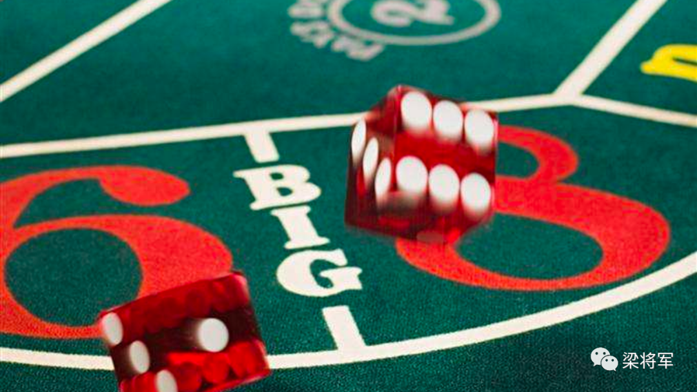
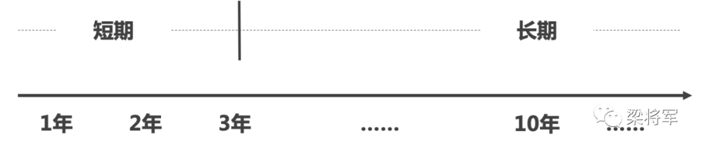
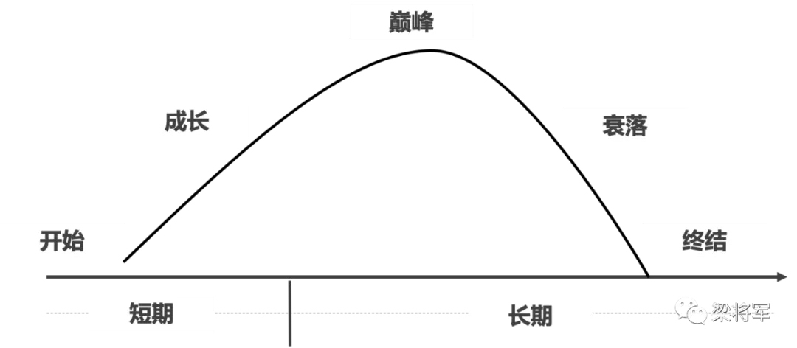
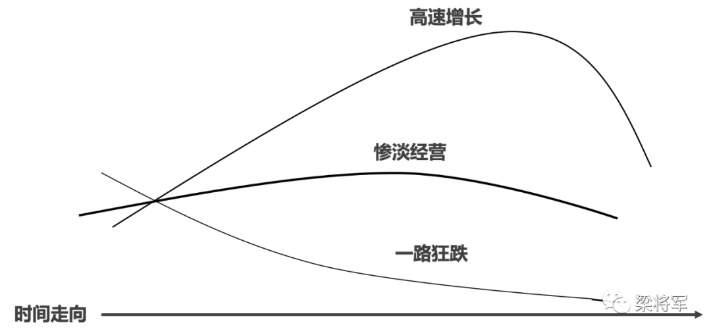
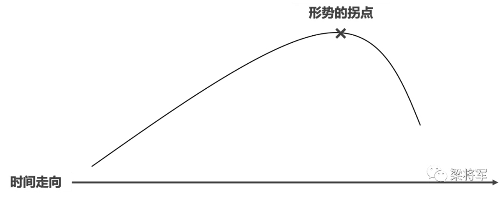
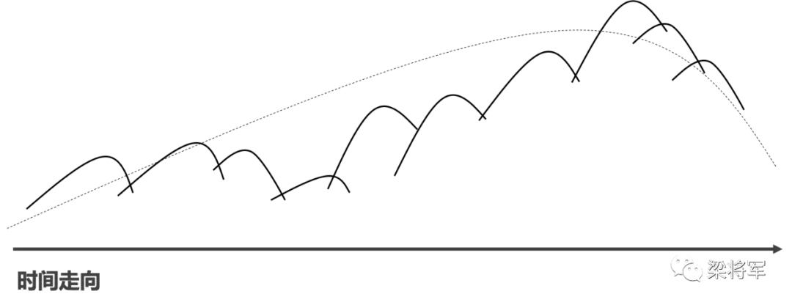
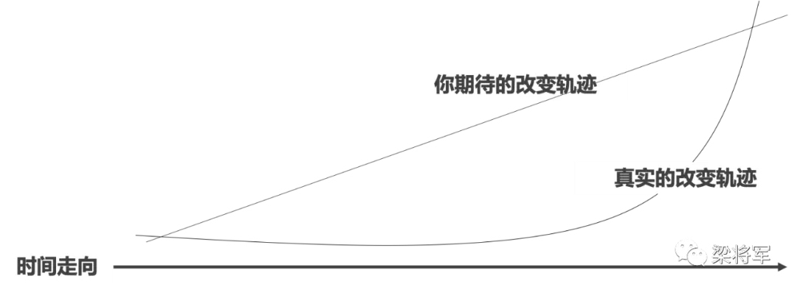
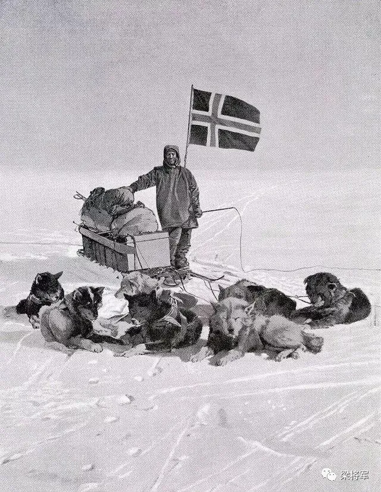

# 被吹爆的「长期主义」到底是什么原理？

「长期」二字就像投资界的哈姆雷特，不同的人对它有着自己的理解。有人常常纠结于「一年算长期持有吗？」这样的问题，有的人全凭直觉就斩钉截跌地给出「长期来看，某价值股总不会一直跌吧」这样的论断。然而，以上这两种情况长期（😂）来看都无益于投资之路上的自我提升。

相比之下，更有意义的做法是：先建立起对「长期」的认知，再让它指导我们的实践，从而获得进步。如果你也认同的话，不妨读读今天精选的这篇文章。

本文作者梁将军，用掷骰子的事例说明了「坚持不等于长期主义，但坚持长期主义很有必要」的道理；借周期与时间长短的比较，讲清楚了投资者对「长期主义」的普遍误解；最后，他也不忘提醒长期主义者：长期并不意味着简单地坚持，而是要对各种不确定做好万全准备。

祝开卷有知。

> 本文转自公众号「梁将军」，ID：liangjiangjunisme

本文转自公众号「梁将军」，ID：liangjiangjunisme

最近，「长期主义」这个词泛滥。

可能是因为高瓴资本的创始人张磊的《价值》出版，让当年被罗振宇老师捧红的「长期主义」，再一次成为商圈里的潮流黑话。

> 罗振宇说：「只有长期主义者，才能成为时间的朋友。」张磊说：「长期主义不仅仅是一种方法论，更是一种价值观。流水不争先，争的是滔滔不绝。」陈春花说：「越是变化，越是需要长期主义。」然后，很多人说：「高手都是长期主义者。」

罗振宇说：「只有长期主义者，才能成为时间的朋友。」 张磊说：「长期主义不仅仅是一种方法论，更是一种价值观。流水不争先，争的是滔滔不绝。」 陈春花说：「越是变化，越是需要长期主义。」 然后，很多人说：「高手都是长期主义者。」

「长期主义」这个词，已经成了企业公关稿、论坛主题、CEO 演讲的标配热词。

但如果你认真地问一个人：什么才是长期主义？如何做事才算是长期主义？大部分人只会哈哈一笑。

今天，我想帮大家消化这个商业热词——*长期主义*。

大部分人理解的长期主义等于坚持。

坚持不懈地把客户放在第一位，不赚快钱；坚持不懈地做品牌，不搞流量；坚持不懈地努力，不搞投机……如果这些就是「长期主义」的定义，那么长期主义者就是我们身边那个一辈子没发财、没升官的老好人。

「长期主义」就是这么一个概念，你初听上去似乎很对，但你不知道它对在哪里。

我有一个描述，是对「为什么要做长期主义者」的最佳解答。

假设你在拉斯维加斯的赌场，正在玩一个掷骰子的赌博游戏。

规则是这样的：荷官投掷骰子，每个骰子的点数都对应 100 万美金，投掷出 1 点就是100 万，投掷出 6 点就是 600 万。你押对点数，就得相应的钱；押错点数，就扣除点数相应的钱。

比如，你押这局会出 4 点，但是打开之后是 1 点，你就赔了 100 万。但是如果你押 6 点，打开也是 6 点，你就会赚 600 万。

问题来了：如果荷官已经连续 6 次没有掷出 6 点了。你愿意在下一次押 6 点吗？如果押对，就有 600 万，押错就赔 600 万。

凭直觉有些人你会觉得下次出 6 点的概率更大，但实际情况是：不管荷官之前投掷出几次 6 点，他下一次开 6 点的概率永远都是六分之一。

其实，我们的人生就像这个赌场游戏一样，你的每一样选择，再不为你带来收益，再不为你带来危险，而往往都是收益越大，风险越大。

但是，人生永远不是考试卷上的数学题。如果这道题，我换个问法，我相信很少有人会理性地给出正确答案。

比如，你初入股票市场，但仅仅凭借你的直觉，连续三次重仓的股票全部飘红，你第四次是会相信直觉重仓一只股票，还是开始认真研究企业财报，理性判断后再做投资决策？

比如，在你上班路上，有一个时速 60KM 的限速摄像头，但你这个月连续三次违章都没被拍到，下个月你还敢在这个路段超速吗？

在我的印象中，大部分人选择了继续靠直觉、继续超速，大家都在人生的一道道数学题里，忘记了基本概率。

那么，我上述的这个例子，和长期主义有什么关系呢？我们来看一张图。

这张图是我随机模拟了，掷骰子出现 6 点的概率分布。

我刚开始掷骰子时，可能会有一段时间里，投出 6 点的概率是远高于六分之一的，但是随着我投掷的次数越来越多、越来越多，出现 6 点的概率会越来越接近六分之一。

我认为这张概率分布图，才是对「长期主义」最好的解答：*只有把时间拉长，我们才能在一个不确定的世界里，得到确定的答案。*

我们只有长期地看赌博游戏，我们才能看出，短期赚到的钱很多是因为运气，只有长期赚到的钱才是实力。

我们常说，时间会给我们答案，这背后的原因是什么？因为从短时间看，人生的样本基数太小了，你对自己的统计结果是错的。

只有把时间拉长，你对自己的认识才是客观的，你才能弄懂：你所谓的成功，哪部分靠的是运气，哪部分靠的是实力？

回到这个最基本的问题：为什么要做一个「长期主义者」？

*因为只有长期主义者，才能「必然」取得最后的成功；非长期主义者，只能得到「偶然」的成功，然后在一次次基本概率事件下，归于平庸。*

既然「长期主义」是成功的必然条件，为什么大多数人还是前仆后继地短视？

因为做一个「长期主义」绝不仅仅是一种价值观，我只要相信就行了，「长期主义」是一个非常难掌握的方法论，做一个长期主义者是需要智慧的。

「长期」是个什么概念？多长才算是「长期」呢？5 年、10 年、还是 20 年？这些答案都不对。

就算你把时间轴拉长到 100 年、1000 年，这个周期够长了吗？但这个答案依然是错的。*因为「长期」的单位不是「年份」，而是「周期曲线」。*

你以为的「长期」可能是这样的：

但真正的长期主义者眼中的「长期」是这样的：

*「长期」的定义是：「长期」是世界上的事物发展的波动周期，而不是时间上的长短。时间上的长度，只是它看起来的样子而已。*

世界上的一切人和事，都是一条时间上的抛物线。

比如，山上的一颗苹果树，它春生、夏长、秋收、冬藏，一次次的生命轮回，就是一条条时间曲线。

比如，公司创立、崛起、成熟、破产……公司这种抽象的生命脉络，同样是一条时间上的抛物线。股票、爱情、事业、时尚……一切的一切，都逃不开这个时间曲线。

那么，如果「长期」的单位是「周期曲线」，长期主义者如何锁定真正的长远目标呢？

**第一种「长期主义」，是识别事物在时间线上的「走向」。**

长期主义的确是一种价值观，但是其实它更是一种方法论。价值观只要你守住自己就行，但是方法论需要一定的智慧，不是你想达成就能达成。

雷军雷总在接受采访时，曾表达过一种观点，他的大意是：之前他是公认的「劳模」，一周七天 996，全年无休，但是金山的成就并不如阿里。他说他看马云天天云游四方，看上去并不如自己努力，为什么比自己强？他因此得出了著名的理论——「风口上的猪」。

一个人如果想成为长期主义者，他首先得学会「夺势」，你必须能看穿事物在时间上的发展脉络，你才能选择到底往哪个方向长期走下去。

在上面这张图里，如果一个长期主义者选错了赛道，时间越长，结果越糟。而且，差之毫厘、谬以千里。

如果你坐在一家从洛杉矶到纽约的飞机上，飞行员把飞行方向调整了 3.5 度。那么这架飞机最终将落地在华盛顿，而不是纽约。

方向是 1，长期坚持是背后的 0，方向偏差一点，越走越远。这对于大多数人都是难比登天的，即便是商业大佬也不能次次都对。

比如，当年阿里要做云计算时，众多大佬表达过不屑的言论。

长期主义者，不止是一头耐力十足的老黄牛，在成为老黄牛之前，他首先是一个预言家，正确地判断未来，才可以坚定地努力下去。

长期主义者，不是用努力去搏未来，而是判断未来之后，像傻子一般努力。

**第二种「长期主义」，是要区分「大周期」和「小周期」。**

当一个长期主义者识别了事物的走势，他接下来就会长久地面对一个问题：走到哪里才算是终点？

即便是巴菲特一样的价值投资者，股票也总有卖掉的一天吧？一个长期主义者，如何判断出哪里才是自己的终局？

当我们预测未来时，一般人以为只要预测出拐点就好，于是他们脑海中的思维图是这样的：

但其实，真实的状况可能是这样的。

*一个漫长的时间周期，是由无数个上下波动的小周期组成的，这些小周期常常会让你误判，让你分不清大周期的拐点到底在哪里。*

*长期，不是时间的线性，而是时间的「套娃」。*

上面这段话可能有点抽象，你可以把这件事想象成一个5年的股票走势图，如果你买了腾讯、谷歌、亚马逊这样的企业。

从一个月看，甚至从半年去看，这支股票的走势可能都是跌的。但如果你拉通5年的周期，会发现这支股票是在「跌跌撞撞」上涨的。

*所以，所谓的长期主义，是一种能穿越小周期，看透大周期的能力。*

长期主义如此重要、又如此难以践行，那么学会什么才能成为一个长期主义者呢？提两个我读过的故事，我觉得这两个故事，就是长期主义的践行案例。

第一个故事来自英国自行车队。

在 2003 年以前，英国自行车队是历史上最失败的车队。因为在过往的 110 年里，英国车队没有在「环法」拿过一块奖牌。

他们业绩烂到制造商都不愿意出售自行车给他们，怕英国车手给自己的品牌蒙羞。

但 2008 年，也就是北京奥运会期间，英国车手卷走了 60% 的金牌；2012 年的伦敦奥运会上，英国队在自家门口打破了 9 个奥运会记录，7 个世界记录；在 2014～2017 年年间，英国车手在 6 年里居然拿到了 5 次「环法」冠军，要知道那可是「环法」啊！

这 10 年期间，到底经历了什么，可以让一支车队脱胎换骨？答案在这个人身上——天空车队总经理戴夫·布雷斯福德（Dave Brailsford）。

戴夫·布雷斯福德在 2003 年跳槽到了英国国家自行车队担任教练，提出了著名的 *「边际增益理论」*。

*「我们遵循这样一条原则：把骑自行车有关的环节拆解，把每个分解出来的部分都改进1%，汇总起来之后，整体就会得到显著提高。」*

比如，他们会用酒精擦轮胎，以获得更好的抓地力；他们给每个队员配备专门的枕头和床垫，让队员在出差的酒店里可以快速入睡；他们甚至把卡车内涂抹成白色，说是便于发现灰尘，这些灰尘会降低调教过的自行车性能……

1% 的改进毫不起眼，但是几百个1%加起来的能量是巨大的。而 10 年里每天改进 1%，量变就会引发质变。而且，有意思的是，这种改变不是渐进式的，而是跳跃式的。

这种跳跃式的改变，就是长期主义者会享受的最大红利，因为只有努力的时间足够长，你才能得到最大的那块蛋糕。

这就是第一个故事，这个故事告诉我们：*长期主义不是坚持重复一件正确的大事，而是坚持改进一件件小事。*

起初很长一段时间，你将看不到任何变化，但一旦累积的时间开始发酵，你会收获一个奇迹。

第二个故事来自两支南极探险队。

1911 年 12 月之后，有两支探险队先后到达了南极，这是人类历史上第一次把足迹留在地球最南端。

这两支队伍，一支队伍是阿蒙森团队，一支队伍是斯科特团队。为了抢先第一步征服地球上最神秘的大陆，两支探险队开启了一场「友谊比赛」。

2 个月后，阿蒙森团队第一个到达了南极，斯科特团队则晚到了一个月。而且，斯科特团队不仅输掉了这场伟大的探险赛，整支队伍都死在了回程路上。

大自然是一视同仁的，为什么一群人荣耀加身，另一群人却客死他乡？

探险家一般有记日记的习惯，所以后人可以清晰地对比出两只探险队的备战差别。

看过许多资料后，我得出一个结论：决定两只团队输赢的差异点有很多，但决定两只团队生死的差异点只有一个——*两只队伍对未来困难的估计*。

*首先，他们选择的交通工具有很大差异。* 阿蒙森团队用的是爱斯基摩犬拉雪橇，而是斯科特团队选择了西伯利亚矮种马和 3 台雪地摩托。事实证明，矮种马和雪地摩托都没法适应南极的冰天雪地。

雪地摩托在卸船时，就有 1 台掉进海里，剩下两台也在极恶的天气下气缸报废，矮种马也根本忍受不了严酷的环境，相继冻死。最终，斯科特团队不得不用人力去拉雪橇。

*其次，他们带的物资也不一样。* 阿蒙森团队是 5 个人，带了 3 吨物资。斯科特团队足有 17 人，却只带了 1 吨物资。

这可能是斯科特团队犯的最致命的错误。因为归程途中煤油不足，团队没法抵御严寒；又因为缺少口粮，大家体力严重透支。

*再有，他们的保暖服饰也不一样。* 斯科特团队并没有像阿蒙森团队一样，大量使用传统皮毛来进行保暖。所以，斯科特队伍里的人冻伤非常严重。

两支团队还有众多的筹备细节是不一样的，这些细节越挖越让我感慨：当我们面对一个长期的、艰难的目标时，如果你不能做好最坏打算，对未来的各种意外有着充分预估，你可能连活命的机会都没有。

而胜利的、并且活着回来的阿蒙森团队做的最正确的事是什么呢？为了南极探险，阿蒙森事先跑到爱斯基摩尔人的生活区，和这些极地人一起生活了 1 年多！

在这 1 年多时间里，阿蒙森学会了如何用皮毛保暖、如何训练狗拉雪橇、如何在极寒之地长久地活下去。所以，阿蒙森根本不是用了 2 个月才到达南极，他是用了 1 年零 2 个月！

*创业、投资、品牌和南极探险是一样的，都是一场漫长的旅程。决定我们抵达终点、并活下去的原因，可能不是最初的实力，而是我们如何能躲过一次又一次的意外。*

这个故事告诉我们：*长期的挑战不是枯燥，而是各种不确定。我们没法在出发前作出完美的计划，但是我们必须做好万全的准备、甚至是超量的准备。*

不死掉，才能一直走下去。

* 长期主义≠坚持，做长期主义的原因是：只有把时间拉长，我们才能在一个不确定的世界里，得到确定的答案。
* 长期主义的长期，不是时间上的长短，而是事物发展的波动周期。关键要学会识别事物在时间线上的「走向」，和学会区分大周期和小周期。
* 做一个长期主义者，不是坚持重复一件正确的大事，而是坚持改进一件件小事；不是忍受枯燥，而是对各种不确定做好万全准备。

长期主义≠坚持，做长期主义的原因是：只有把时间拉长，我们才能在一个不确定的世界里，得到确定的答案。

长期主义的长期，不是时间上的长短，而是事物发展的波动周期。关键要学会识别事物在时间线上的「走向」，和学会区分大周期和小周期。

做一个长期主义者，不是坚持重复一件正确的大事，而是坚持改进一件件小事；不是忍受枯燥，而是对各种不确定做好万全准备。

我们的朋友圈里，经常飘荡出各种激动人心的概念，但不要成为那个只会喊口号的人。

去成为那个独立思考后，坚定的践行者。

共勉之。

**延伸阅读**[CxEric：对价值投资的过分简化与玄学化](https://youzhiyouxing.cn/n/materials/564)[基金锁三年，就是价值投资了?](https://youzhiyouxing.cn/n/materials/840)[孟岩：散户买平安长期持有与买公募基金，哪个更好？](https://youzhiyouxing.cn/n/materials/41)

> 来源：公众号「梁将军」转载文章发表的所有信息仅代表作者个人观点，不对您构成任何投资建议，详见[《文章免责声明》](https://youzhiyouxing.cn/agreements/ARTICLE_DISCLAIMER)
