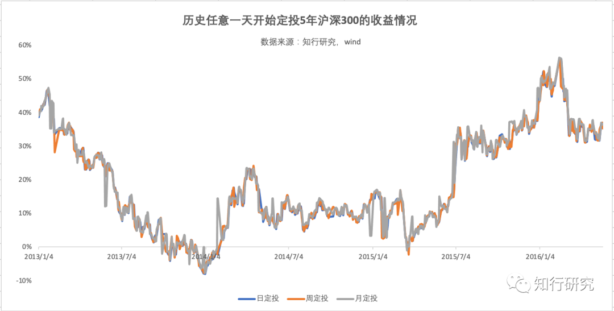

# 定投专题（六）：别纠结

这是咱们定投专题的最后一篇文章。相比前面，今天的内容则要简单轻松得多。因为今天的内容只有一个目的 —— *让你在定投的时候，不要在不该纠结的地方纠结*。

为什么这么说呢?

虽然我很少直接在用户群里回答问题，但我也一直坚持潜水，发现大家真的会纠结于很多问题。*最重要的是，有的问题根本没必要纠结啊。* 🤦‍♀️

前段时间，我们向你推荐的《[一篇文章说清楚我们和金钱的关系](https://youzhiyouxing.cn/n/materials/875)》，不知道你看了没。

文中介绍了财富的几个维度，其中，在较高的维度里，注意力就是财富。所以，不要轻易贡献你的注意力，哪怕是投资。

接下来，我们就看看大家在定投上的*典型纠结案例*。

一个典型纠结的例子是：*选什么「定投周期」*。

从回测数据来看，在不加入其他策略情况下，我们能发现按日、周、月定投在长期收益上的差距微乎其微：

*基本可以认为，日定投、周定投和月定投收益上没有显著差别。*

对于普通工薪人群来说，「月定投」是最符合习惯和资金使用效率最高的方式。因此，目前几乎所有平台，初始定投周期都是「月定投」。

但是，为什么很多平台最后还是推出了「周定投」，甚至「日定投」呢？

*这主要是为了满足很多人心理上的需求——经常操作一下账户，似乎这样可以提高收益*。

行为金融学里，把人们这种喜欢频繁交易的现象称作：过度交易。而根据研究，多数时候，*频繁的交易并不会带来更高的收益，反而增加了交易成本*。

还好，对于定投来说，虽然更频繁的定投操作并不会提高收益率，但是只要不卖出，成本是差不多的。

假如你能「爽到」，增加一点定投频率也未尝不可。

所以，别纠结，喜欢什么周期就大胆选。

另一个典型的纠结案例是：*定投的时候，应该选择「场内」还是「场外」？*

给不了解的同学解释一下，这个「场」指的是二级市场，也就是证券交易所。

对一些基金而言，比如 ETF、LOF，它们既可以在交易所使用股票账户买卖（场内交易），也可以在且慢、天天基金等基金销售平台进行申购赎回（场外交易）。

我们来分析一下场内定投和场外的主要差异：

## 一、费率差异

场内定投比场外基金费率更低一直是场内定投广泛宣传的优点。

但是实际上，*哪个费率更便宜，还是需要具体情况具体分析*。

以一般情况下买入时的费用为例：

场内基金的交易费率目前在 0.03% 左右；而权益基金的场外申购费率多是 1.2%～1.5%，由于目前普遍 1 折，实际上也就是 0.12%～0.15%。

表面上看，场内 0.03% 是比场外 0.12%～0.15% 的费率便宜不少。

*但是，注意了，部分证券公司有单笔费用最低 5 元的限制*。

假如我们按照定投 2000 元来算，在场内按 0.03% 收费是 0.6 元，不足 5 元按照 5 元收取，实际上收取的费率是 0.25%，居然要比场外申购还贵。

加上现在各个证券公司、基金公司的优惠政策也层出不穷、千变万化。所以，*如今哪种方式定投便宜真的要看具体情况，不能一概而论了*。

## 二、价格差异

场内场外定投的另一个差异是*成交价格*。

同一只基金，场外一天只有一个净值；而场内价格则和股票一样，是实时波动的。

虽然场内价格的波动一般不会偏离场外太多，但会受到交易情绪等多种因素影响。

*这就意味着，在场内进行定投，既有可能买得比当天场外净值更便宜，也有可能买得比当天场外净值更贵。*

## 三、便捷程度差异

看到这里，你是不是感觉场内定投真的有点麻烦 😢

是的，*场内定投的操作确实比较繁琐，而且基本上不支持自动和智能化定投*。

而场外目前自动化和智能定投已经很成熟，简单设置一次，就会定期扣款购买。

投资者无需面对市场涨跌带来的情绪干扰，也有助于你保持良好的心态。

*对于不想花费太多精力的人来说，可以无脑选场外。*场内定投，则适合那些已经习惯于场内交易的小伙伴。在部分情况下，确实能做到费率更低、成本更低。

最后，还有个问题很典型，就是当天大涨，咱们还正常定投吗？

这个问题的回答很简单：*按策略纪律正常操作*。

大家一般会觉得，当天大涨，岂不是要买贵了？为啥不等更便宜了再买呢？

有的策略，比如我们前面介绍的定投买入策略，可以借助股票市场温度，在高温时暂停定投，这是可以的。

*但一定记得的是千万别主观判断。*

我们是无法预测未来行情的，所以，按照既定策略纪律操作非常必要。万一未来一直涨下去，我们反而错失了低成本买入的机会。

这三个问题不一定能覆盖你所有的纠结点，但相信你能通过这三个问题总结出一个结论：

*定投是一个长期的投资行为，你的所有选择只要自己舒服，能坚持下去，就别纠结太多。*

咱们前面说过很多「术」的东西，但今天，在最后一篇文章，我们却希望回归到道上。

*希望你明白，只要咱们别买得太贵，长期坚持，大概率是不会出错的。*

正如老子在《道德经》中说：

「将欲取天下而为之，吾见其不得已。天下神器，不可为也，不可执也。为者败，执者失。是以圣人无为，故无败；无执，故无失。夫物或行或随，或嘘或吹，或强或羸，或载或隳（huī）。是以圣人去甚，去奢，去泰。」

投资也是一样，有时不需太过追求完美，有舍才能有得。

*有时放弃对于细枝末节的过度追究，才能透过纷繁复杂的表面抓住事物的本质。*

**延伸阅读**[定投专题（一）：什么时候开启定投合适?](https://youzhiyouxing.cn/n/materials/767)[定投专题（二）：定投成本，还能更低吗?](https://youzhiyouxing.cn/n/materials/841)[定投专题（三）：买得好不如卖得好？](https://youzhiyouxing.cn/n/materials/888)[定投专题（四）：最重要的还是坚持](https://youzhiyouxing.cn/n/materials/907)[定投专题（五）：定投依旧要选好资产](https://youzhiyouxing.cn/n/materials/924)[定投专题（六）：别纠结](https://youzhiyouxing.cn/n/materials/933)

> 本文章所载信息仅供参考，不构成任何投资建议。如转载使用，请参考[《文章转载声明》](https://youzhiyouxing.cn/agreements/ARTICLE_REPRINTED)
