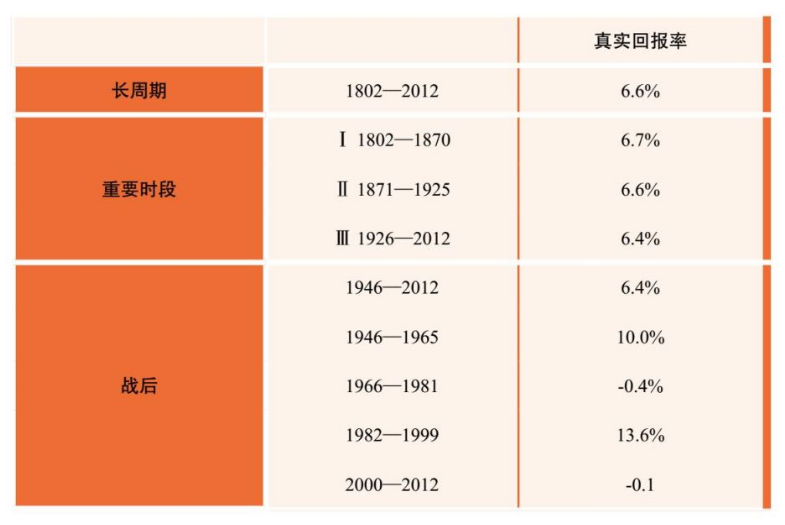

# 什么是投资的大道？

有关价值投资的书籍如汗牛充栋，文章更是数不胜数，但价值投资这四个字背后包含的理念其实并没有那么复杂。

李录先生将价值投资的理念总结为四点：

1. 股票是公司的部分所有权；2. 理解市场先生；3. 投资要留安全边际；4. 在能力圈内做投资。

这四条可以算是价值投资大厦的基石，各个投资大师的投资方法和特点各有不同，但其实都是建立在这几条理念的基础上：格雷厄姆更偏重公司的清算价值，芒格则能一眼看穿很多公司未来 20 年的现金流，邓普顿爵士的逆向投资则充分地利用了市场先生的不理性……

无论是从业者还是投资者，我们都应该走在这样的投资大道上，这样我们才能走得踏实，取得可持续的成功。不过，这条路很长很枯燥，旁边的岔路又充满了各种新奇刺激，一不留神儿，我们就会被短期利益诱惑，迷失原来的方向。

看完这篇文章，可以闭上眼睛想一想，你是走在「一步一个脚印的投资大道」上，还是「极具迷惑性的泥泞小路」上？

祝开卷有知。

对个人投资者来说，比较好的办法是去投资股票，尽量避免现金。但很大的一个问题就是，股票市场一直在上下波动，而且在短期我们需要资产的时候，它变化的量通常很大，时间也通常会很长。

从表 1 我们可以看到，美国股市过去 200 年平均回报率差不多是 6.6%，每六十几年的回报率也差不多是这个数字，相对来说，比较稳定。

表 1：1802 年至 2012 年期间美国股市不同时段的回报率

可是当我们把时间放得更短一些的时候，你就会发现它的表现很不一样。例如：

* 战后从 1946 年到 1965 年，美国股市的平均回报率是 10%，比长期回报率要高很多；
* 可是在接下来的 15 年里，1966～1981 年，不仅没有增长，而且连续 15 年价值都在跌；
* 在接下来的 16 年里，1982～1999 年，又以更高的速度，13.6% 的速度在增长；
* 可是接下来的 13 年，又开始进入一个持续的下跌的过程。整个 13 年的时间里，价值是在下跌的。

战后从 1946 年到 1965 年，美国股市的平均回报率是 10%，比长期回报率要高很多；

可是在接下来的 15 年里，1966～1981 年，不仅没有增长，而且连续 15 年价值都在跌；

在接下来的 16 年里，1982～1999 年，又以更高的速度，13.6% 的速度在增长；

可是接下来的 13 年，又开始进入一个持续的下跌的过程。整个 13 年的时间里，价值是在下跌的。

所以才有约翰·凯恩斯（John Keynes）著名的一句话：「长期来看，我们都死了（In the long run we are alldead）。」

毕竟每一个人投资的时间是有限的。绝大部分投资人有公开记录的时间也就是十几、二十年。可是如果赶上 1981 年，或者 2001、2002 年，十几年的收入都是负的。所以作为投资人，如果看股票这样长期的表现，那投资指数基金就可以了。

可具体到对个人有意义的时间段，会发现可能连续十几年的时间里面，股票回报都是负数。而在其他时间段里，你会觉得自己是天才，什么都没做每年就有 14% 的回报。如果你不知道这个回报是怎么取得的，就无法判断你的投资是靠运气还是靠能力。

假设我们投资的时间周期就只是十几年，你真的很难保证你的投资一定会得到可观的回报。同时，股市的波动在不同的时间里也非常剧烈。

所以，我们下面的问题就是：

* 有没有一种比投资指数更好的方法，更能可靠地在不同的年份里面，在我们大家需要钱的年份里面，仍然能以超越指数回报的方法可靠地保障客户的财产？能够让客户财产始终参与到经济复利增长里，获得长期、可靠、优秀的回报？
* 有没有这样一种投资方法，不是旁门左道，可以不断被重复、学习，可以长期给我们带来这样的结果？

有没有一种比投资指数更好的方法，更能可靠地在不同的年份里面，在我们大家需要钱的年份里面，仍然能以超越指数回报的方法可靠地保障客户的财产？能够让客户财产始终参与到经济复利增长里，获得长期、可靠、优秀的回报？

有没有这样一种投资方法，不是旁门左道，可以不断被重复、学习，可以长期给我们带来这样的结果？

在过去这几十年里，在我所了解的范围内，投资领域各种各样的做法都有。

就我能够观察到的、能够用数据统计说话的，能够在长时间里面可靠、安全地给投资者带来优秀长期回报的投资理念、投资方法、投资人群只有一个，就是价值投资。

如果我必须要用长期的业绩来说明，我发现真正能够有长期业绩的人少之又少。而所有真正获得长期业绩的人几乎都是这样的投资人。

今天市场上最大的对冲基金主要做的是债券，有十几年很好的收益。可是在过去十几年里面无风险长期债券回报率从 6%、7%、8% 到几乎是零，如果配备 2 到 3 倍的杠杆就是 10%，如果配备 5 到 6 倍的杠杆差不多 13% 左右，这样的业绩表现是因为运气还是能力很难判定，哪怕有十几年的业绩。

而能够获得长期业绩的价值投资人，几乎在各个时代都有。在当代，沃伦·巴菲特（Warren Buffett，以下简称「巴菲特」）的业绩是 57 年，其他还有一些大概在二三十年左右。这些人清一色都是价值投资者。

如果我是各位，一定要弄清楚什么是价值投资，了解他们怎么取得这些成绩。多年前，我听的第一门关于投资的课就是巴菲特的课，那时候听课的人和今天这里一样少，巴菲特第一次到哥大演讲，我那天误打误撞坐在那儿。我想弄清楚价值投资到底是什么东西，为什么这么多人能够在这么艰苦的环境里面取得这么优异的成绩，而且是持续的。

什么是价值投资？价值投资最早是由本杰明·格雷厄姆（Benjamin Graham，以下简称「格雷厄姆」）在八九十年前最先形成的一套体系。在价值投资中，今天重要的领军人物、代表人物当然就是我们熟知的巴菲特先生了。但是它包含哪些理念呢？其实很简单，价值投资的理念只有四个。大家记住，只有四个。前三个都是巴菲特的老师格雷厄姆的概念，最后一个是巴菲特自己的独特贡献。

第一，股票不仅仅是可以买卖的证券，实际上代表的是对公司所有权的证书，是对公司的部分所有权。这是第一个重要的概念。这个概念为什么重要呢？投资股票实际上是投资一个公司，公司随着 GDP 的增长，在市场经济持续增长的时候，价值本身会被不断地创造。那么在创造价值的过程中，作为部分所有者，我们持有部分的价值也会随着公司价值的增长而增长。

如果我们以股东形式投资，支持了这个公司，那么我们在公司价值增长的过程中，分得我们应得的利益，这条道是可持续的。什么叫正道，什么叫邪道？正道就是你得到的东西是你应得的，所以这样的投资是一条大道，是一条正道。可愿意这样理解股票的人少之又少。

第二，理解市场是什么。股票一方面是部分所有权，另一方面它确确实实也是一个可以交换的证券，可以随时买卖。这个市场里永远都有人在叫价，那么怎么来理解这个现象呢？在价值投资人看来，市场的存在只是为你而服务的。能够给你提供机会，让你去购买所有权，也会给你个机会，在你很多年之后需要钱的时候，能够把它出让，变成现金。所以市场的存在是为你而服务的。

这个市场从来都不能告诉你，真正的价值是什么。它能够告诉你的只是价格是什么，你不能把市场当作你的老师，你只能把它当作一个可以利用的工具。这是第二个非常重要的观念。但这个观念又和几乎 95% 以上市场参与者的理解正好相反。

第三，投资的本质是对未来进行预测，而预测得到的结果不可能百分之百准确，只能是从零到接近一百。那么当我们做判断的时候，就必须要预留很大的空间，叫安全边际。因为你没有办法分辨，所以无论你多有把握的事情，都要牢记安全边际，你的买入价格一定要大大低于公司的内在价值。这个概念是价值投资里第三个最重要的观念。

因为有第一个概念，股票实际上是公司的一部分，公司本身是有价值的，有内在的价值，而市场本身的存在是为你来服务的，所以你可以等着当市场价格远远低于内在价值的时候再去购买。当这个价格远远超出它的价值时就可以卖出。

这样一来，如果对未来的预测是错误的，我至少不会亏很多钱；常常即使你的预测是正确的，比如说你有 80%、90% 的把握，但因为不可能达到 100%，当那 10%、20% 的可能性出现的时候，这个结果仍然对你的内在价值是不利的，但这时如果你有足够的安全边际，就不会损失太多。假如你的预测是正确的，你的回报就会比别人高很多很多。你每次投资的时候都要求一个巨大的安全边际，这是投资的一种技能。

第四，巴菲特经过自己 50 年的实践增加了一个概念：投资人可以通过长期不懈的努力，真正建立起自己的能力圈，能够对某些公司、某些行业获得比几乎所有人更深的理解，而且能够对公司未来长期的表现，做出比所有其他人更准确的判断。在这个圈子里面就是自己的独特能力。

能力圈概念最重要的就是边界。没有边界的能力就不是真的能力。如果你有一个观点，你必须要能够告诉我这个观点不成立的条件，这时它才是一个真正的观点。如果直接告诉我就是这么一个结论，那么这个结论一定是错误的，一定经不起考验。能力圈这个概念为什么很重要？是因为「市场先生」。

市场存在的目的是什么？对于市场参与者而言，市场存在的目的就是发现人性的弱点。你自己有哪些地方没有真正弄明白，你身上有什么样的心理、生理弱点，一定会在市场的某一种状态下曝露。所有在座曾经在市场里打过滚的，一定知道我说这句话的含义。

市场本身是所有人的组合，如果你不明白自己在做什么，这个市场一定会在某一个时刻把你打倒。这就是为什么市场里面听到的故事，都是大家赚钱的故事，最后的结果其实大家都亏掉了。人们总能听到不同新人的故事，是因为老人都不存在了。

这个市场本身能够发现你的逻辑，发现你身上几乎所有的问题，你只要不在能力圈里面，只要你的能力圈是没有边界的能力圈，只要你不知道自己的边界，市场一定在某一个时刻、某一种形态下发现你，而且你一定会被它整得很惨。

只有在这个意义上，投资才真正是有风险的，这个风险不是股票价格的上上下下，而是资本永久性地丢失，这才是真正的风险。这个风险是否存在，就取决于你有没有这个能力圈。而且这个能力圈一定要非常狭小，你要把它的边界，每一块边界，都定义得清清楚楚。只有在这个狭小的边界里面，才有可能通过持续长期的努力建立起真正对未来的预测。这是巴菲特本人提出的概念。

格雷厄姆的投资方法，找到的都是没有长期价值、也不怎么增长的公司。而能力圈的这个概念，是巴菲特本人通过实践提出的。如果真的接受这四个基本理念，你就可以以足够低的价格，买入自己能力圈范围内的公司并长期持有，通过公司本身内在价值的增长，以及价格对价值的回归，取得长期、良好、可靠的回报。

这四个方面合起来，就构成了价值投资全部的含义、最根本的理念。价值投资的理念，不仅讲起来很简单、很清晰，而且是一条大道、正道。正道就是可持续的东西。什么东西可持续？可持续的东西都具有一个共同的特点，就是你得到的东西在所有其他人看来，都是你应得的东西，这就可持续了。

如果当你把自己赚钱的方法毫无保留地公布于众时，大家都觉得你是一个骗子，那这个方法肯定不可持续。如果把赚钱的方法一点一滴毫无保留告诉所有的人，大家都觉得你这个赚钱的方法「真好」「真对」「我佩服」，这就是可持续的。这就叫大道，这就叫正道。

为什么价值投资本身是一条正道、大道？因为它告诉你投资股票，其实是在投资公司的所有权。投资首先帮助公司的市值更接近真实的内在价值，对公司是有帮助的。你不仅帮助公司不断地增长自己的内在价值，而且，随着公司在 3.0 文明里不断增长，因为增长造成的公司内在价值不断增长，你分得了公司价值的部分增长，同时为客户提供持续、可靠、安全的回报，你对客户提供的也是长期的东西。

最后的结果帮助了经济，帮助了公司，帮助了个人，也在这个过程里面帮助了自己，这样你得到的回报是你应得的，大家也觉得你得到的是你应得的。所以这是一条大道。

你不被市场的上上下下所左右，你能够清晰地判断公司的内在价值是什么，同时你对未来又怀有敬意，你知道未来预测也很不确定，所以你用足够的安全边际来适当地分散风险。这样一来，你在犯错的时候不会损失很多，在正确的时候会得到更多。这样的话，你就可以持续不断地、稳定地让你的投资组合，长期实现高于市场指数的、更安全的回报。

如果你是一个什么都没有的人，你首先抽 2% 佣金，赢的时候再拿 20%，如果输的话把公司关掉，明年再开一个公司，当你把这一套作为跟大家讲的时候，大家会觉得你得到的东西是应得的吗？还是觉得监牢是你应得的呢？但你如果坚持了巴菲特的方法，在价格上预留很多安全边际，加上适当的风险分散，帮助所有的人共赢，在所有人共赢的情况下你能够收取一部分小小的费用，大家就觉得你得到的东西真是你应得的，这就走到了投资的大道、投资的正道。

这就是价值投资全部的理念。听起来非常地简单，也非常合乎逻辑。可是现实的情况是什么样呢？在真正投资过程中，这样的投资人在整个市场里所占的比例少之又少。几乎所有跟投资有关的理论都有一大堆人在跟随，但是真正的价值投资者却寥寥无几。于是，投资的特点是：大部分人不知道你做的是什么，投资的结果变成财富杀手。我们刚刚经过的这次股灾牛熊转换（注：李录发言于 2015 年 10 月）就是一个最好的例证。

而投资的大道上却根本没人，交通一点都不堵塞，冷冷清清。人都去哪了呢？旁门左道上车水马龙！也就是说，绝大多数人走的是小道。为什么走小道呢？因为康庄大道非常慢。听起来能走到头，但实际上很慢。

价值投资从理论上看起来，确实是一条一定能够通向成功的道路，但是这个道路最大的问题是太长。也许你买的时候，正好市场对公司内在价值完全不看好，给的价格完全低于所谓的内在价值，但你也不知道什么时候市场能变得更加理性。而且，公司本身的价值增长要靠很多很多方面，需要公司管理层上下不断地努力工作。我们在生活里也知道，一个公司的成功需要很多人，很多时间，需要不懈的努力，还需要一些运气。所以这个过程是一个很艰难的过程。

另外一个很难的地方是你对未来的判断也很难。投资的本质是对未来进行预测，真正要理解一个公司、一个行业，要能够去判断它未来 5 年、10 年的情况。在座哪一位可以告诉我，某一个公司未来 5 年的情况你可以判断出来？这不是一件很容易的事情。我们在决定投资之前，至少要知道 10 年以后这个公司大概会是什么样，低迷时什么样，否则怎么判断这个公司的价值不低于这个范围？要知道这个公司未来未来十几年、二十几年里，每年产生的现金流反映到今天是多少。

作为公司创始人，（公司）明年什么样（你）知道吗？你说「知道」，这是跟客户、跟投资人讲。有的时候跟你们的员工这么讲：「我们公司要做世界 500 强。」其实你并不一定真的能够去预测 10 年以上公司的发展。能够这样预测的人少之又少，因为不确定因素太多，绝大部分行业、公司没有办法去预测那么长。

但是不是完全没有？也不是。其实你真正努力之后会发现：在某一些公司里，在某一些行业里，你可以看得很清楚。10 年以后这个公司最差能差到什么样子？有可能比这好很多。但这需要很多年不懈的努力，需要很多年刻苦的学习，才能达到这样的境界。

当你能够做出这个判断的时候，你就开始建立自己的能力圈了。这个圈开始的时候一定非常狭小，而建立这个圈子的时间很长很长。这就是为什么价值投资本身是一条漫漫长途，虽然肯定能走到头，但是绝大部分人不愿意走。它确实要花很多很多时间，即便花很多时间，了解的仍然很少。

你不会去财经频道上张口评价所有的公司，马上告诉别人股票价格应该是什么样。你如果是真正的价值投资人，绝对不敢这么讲；你也不敢随便讲 5000 点太低了，大牛市马上要开始了，至少 4000 点应该抄底；不能讲这些，不敢做这些预测。

如果你是一个真正的投资人，显然我们刚才说的这几条都在能力圈范围外，怎么画这个大圈也包括不了这个问题。凡是把圈画得超过自己能力的人，最终一定会在某一个市场环境下把他自己彻底毁掉。

市场本身就是发现你身上弱点的一个机制。你身上但凡有一点点不明白的地方，一定会在某一个状态下被无限放大，以至于把你彻底毁了。

做这个行业最根本的要求，是一定要在知识上做彻彻底底、百分之百诚实的人。千万不能骗自己，因为自己其实最好骗，尤其在这个行业里。只要屁股坐在这儿，你就可以告诉别人假话，假话说多了连你自己都信了。但是这样的人，永远不可能成为优秀的投资人，一定在某种市场状态下彻底被毁掉。这就是为什么我们行业里面，几乎产生不了很多长期的优秀投资人。

我们今天谈论的一些所谓明星投资人，有连续十几年 20% 的年回报率，可是最后一年关门的时候一下子跌了百分之几十。他在最早创建基业的时候，基金规模很小，丢钱的时候基金的规模已经很大，最终为投资者亏损的钱可能远远大于为投资者赚的钱，但是他自己赚的钱很多。如果从开头到结尾结算一下，他一分钱都不应该赚。这就是我前面说的这个行业最大的特点。

所以虽然这条路看起来是一条康庄大道，但实际上它距离成功非常遥远。很多人被这吓坏了。同时，因为这个市场总是让你感觉到短期可以获利——你短期的资产确确实实可以有巨大的变化，所以这会给你幻觉，让你想象在短期里可以获得巨大利益。这样你会更倾向于希望把你的时间、精力、聪明才智放在短期的市场预测上。这就是为什么大家愿意去抄近道，不愿意走大道。

而实际上几乎所有的近道都变成了旁门左道。因为几乎所有以短期交易为目的的投资行为，如果时间足够长的话，最终要么就走入了死胡同，要么就进入了沼泽地。不仅把客户的钱损失殆尽，而且连带着把自己的钱也损失了。

所以我们看到长期来说，至少在美国的交易记录，几乎所有以短期交易为目的、形形色色的所谓战略（策略），几乎没有长期成功的记录。而那些真正长期的、优秀的投资记录中，几乎人人都是价值投资者。

短期的投资业绩常常受到整个市场运气的影响，和你个人能力无关。比如说给一个很短的时间，不要说一两年，在任何时候，一两个礼拜，都会出现一些股神。在中国过去 8 个月里（注：李录发言于 2015 年 10 月），都不知道出现了多少股神了，好多股神却最后跳楼了。

在短期永远都可以有赢家输家，但是长期的赢家就很少了。所以哪怕是 1 年、2 年，甚至于 3 年、5 年，甚至于 5 年、10 年，很好的业绩常常也不能够去判定他未来的业绩如何。

例如有人会告诉我他业绩很好，就算是 5 年、10 年，如果我看不到他实际的投资结果，我仍然没有办法判断他的成功是因为运气还是能力。这是判断价值投资的一个核心问题，是运气还是能力。

市场可以连续 15 年达到 14% 的平均累计回报，这时你根本不需要做一个天才，只要你在这个市场里，你的业绩就会非常好。可是也会有时候，在市场里连续十几年，回报是负的，如果你在这个时候回报还非常优秀就又不一样了。

所以如果我看不到你具体的投资内容，一般来说很难判断。但是如果我的一个投资经理可以连续 15 年以上都保持优异的成绩，在正确的道路上研究，一般来说基本上就成才了。这时就是能力远远大于运气，我们基本上就可以判定他的成功。也就是说，在这个行业里，要在很长时间持续不断地艰苦地工作，才有可能真正地成才，这个时间恐怕要 15 年以上。

这就是为什么虽然这条康庄大道一定会通向成功，但交通一点都不堵塞，走的人寥寥无几。但恰恰这就是那些想走一条康庄大道、愿意走一条艰苦道路的人的机会。这些人走下来，得到的成功确确实实在别人看来就是他应得的成功。这样的成功才是可持续的，才是真正的大道。你得到的成功真正是你付出得来的，别人认可、你也认可，所有其他人客观地看也认可。

所以我希望，今天在座的同学，能够下决心做这样的人，走这样的道路，取得这样应得的成功，这样你自己也心安。你不再是所有赚来的钱，都是靠短期做零和游戏，不再把客户的钱变戏法一样变成自己的钱。

如果你进入这个行业，不具备我开始讲的两条基本道德价值底线，你一定会在成功的过程中，为广大的老百姓提供很多摧毁财富的「机会」，一定是有罪的。（注：两条底线是：「追求真知」和「珍视托付」，详见文末的链接。）

我提醒那些尤其还在学校里面念书、想进入这个行业的的学生，扪心自问：你有没有受托人责任？有没有这种基因？如果没有，奉劝你千万不要进入这个行业，你进这个行业一定是对社会的损害。当然，可能在损害别人的时候，自己变得很富有。但我不认为我能在这种情况下安枕无忧，日子过得舒心，虽然很多人可以。我希望你们不是（这样的人），我希望你们进入这个行业以后，千万不要做这样的事。

如果你没有受托人责任的基因，又进入这个行业，最后你就跟所有人一样很快进入旁门左道，在所有的捷径里面，要么一下子闯到死胡同，要么进入泥沼地，带进去的都是客户的钱。

如果人不是太聪明，最后会把自己的钱都赔进去，一定是这样的结果。如果（各位）没有对于真理智慧的追求；没有把这种追求作为对自己的道德要求；没有受托人的基因，不能建立起受托人的责任，把所有客户给你的每一分钱，当作你父母辛勤积攒一辈子交给你打理的钱。没有这样的精神，奉劝各位不要进入这个行业。

所以我希望大家在进入这个行业之初，一定要树立这样的观念，一定要走正路。

[书摘一：如何寻找值得托付的财富管理人？](https://youzhiyouxing.cn/n/materials/35)[书摘二：哪些金融资产可以持续可靠地创造收益？](https://youzhiyouxing.cn/n/materials/39)

> 来源：《文明、现代化、价值投资与中国》转载文章发表的所有信息仅代表作者个人观点，不对您构成任何投资建议，详见[《文章免责声明》](https://youzhiyouxing.cn/agreements/ARTICLE_DISCLAIMER)
