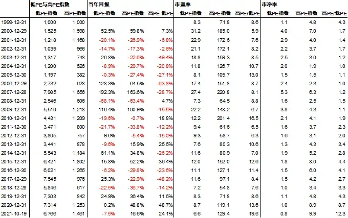

# 估值体系扭曲时，资深价值投资者的坚持

最新一期「无人知晓」——「E06 孟岩对话曹名长：投资收益是基金经理和投资者共同创造的」上线之后，我们终于得以窥见在A股市场中坚持价值投资将近 20 年的知名老将曹名长的内心世界。

曹名长和孟岩聊到，在经历三轮牛熊之后，面对 2020 年 11 月 2 日投资人在基金打开申购后，将他所管理的资金从 74.4 亿元的规模，集中赎回至 4 亿多元的残酷现实时，他内心是否有过动摇；也聊到低估值价值投资者在市场风格不匹配的情形下应该如何保持好心态；最让听众感动的是曹名长还是「想帮普通人管好钱」。

今天分享给大家的这篇文章，像是上述播客内容的一则互文，而文章作者陈嘉禾，和曹名长一样，也是「无人知晓」的嘉宾之一。陈嘉禾以发展性的第三视角，着眼于 2019-2021 年市场风格与低估值投资高度相背时，A股市场三位资深价值投资者的尴尬业绩，从表象钻进更深的思考。他看到的，是价值投资者在逆风时更为艰难的坚守。

在这篇文章中，陈嘉禾并没有「下个结论」，我们最终都要继续观察、保持思考。

祝开卷有知。

在资本市场上，许多资深投资者都会念叨一句话：「*没有任何一种投资风格可以永远风光。*」也就是说，虽然在长周期上，秉承正确投资方法可以赚到不错的收益，但是谁都没法保证，自己的业绩在每个三五年里都漂漂亮亮。

就以沃伦﹒巴菲特为例，这位最成功的价值投资者，也曾经在 1966 年到 1975 年的整整 10 年里，取得过仅仅 122% 的回报率，折合年化收益 8.3%（数据参见伯克希尔﹒哈撒韦公司的年报）。可想而知，如果站在 1975 年的年底，有多少人会说，「这个投资者在过去 10 年里只赚了 122%，投资他的产品真还不比存银行好多少啊！」甚至连查理﹒芒格自己，在当时都说，账面的业绩简直糟糕透了（The paper record was terrible）。

但是，在 1976 年到 1985 年的下一个 10 年中，巴菲特的综合回报率达到了惊人的 5,922%，也就是把 1976 年的 1 美元变成了 1985 年的 60.2 美元。对于那些在 1975 年的年底，因为过去 10 年业绩不好而看衰巴菲特的投资者来说，他们无疑犯下了一个巨大的错误。

巴菲特的例子告诉我们，即使是用 10 年为周期，资本市场上的业绩也可能是会骗人的。仅仅凭借短期（其实 10 年也不算是短期了，可以算是中期、甚至较长的中期）业绩的好坏，就认为某个投资者不行了、或者某种投资方法不行了，*而不论这种短期业绩低迷的原因是什么，业绩低迷究竟是由于投资经理损毁了投资组合的商业价值而造成的，还是由于投资经理虽然增加了投资组合的商业价值、但是遭遇了市场风格逆风造成的，这样做投资是一定会吃亏的*。

在中国资本市场，在起始于 2019 年底、延续到 2021 年的市场行情中，我们就能够看到一个非常典型的极端案例。在这个案例中，资本市场的定价机制发生了巨大的扭曲，扭曲幅度之大在历史上都十分罕见。而在这个巨大的定价机制扭曲中，一些坚定的价值投资者也因为坚守自己的投资信念，遭遇了前所未有的逆风。

在这样巨大的逆风中，市场参与者们一度认为，这些曾经在历史上取得了优秀投资业绩的价值投资者们，已经无法适应将来的市场风格。但是，大家多半并没有关注他们的短期业绩为何如此不堪，业绩差的原因究竟是价值损毁，还是短期市场风格扭曲。而这样「只看业绩、不管原因」的投资判断方法，是过于简单粗暴的。

概括来说，*发生在 2019 年下半年到 2021 年之间的资本市场风格扭曲，主要表现为估值越高的公司反而容易表现越好、估值越低的公司反而表现越差*。这种差别不光体现在行业与行业之间，比如银行业估值低表现更差、新能源行业估值高表现更好，同时也体现在同一行业的公司中，比如证券行业中估值越低的大型证券公司，在净资产回报率（RoE）更高的同时，反而估值表现更差。

对于这一风格扭曲，从 2000 年即开始编辑的申万风格指数，非常好的记录下了扭曲的程度有多么剧烈。

以申万低市盈率（PE）指数和高市盈率指数这两个指数的对比为例，这两个指数分别代表了A股市场低市盈率公司和高市盈率公司的表现，两个指数各有 300 个成分股，可以说代表性比较强。*在 2000 年到 2018 年的 19 年中，高PE指数的年度回报率，平均比低PE指数的年度回报率低13.7%。*而且，在这 19 年中，高 PE 指数的年度表现比低 PE 指数好的，只有 2008、2010、2013、2015 这 4 年，4 年的平均超额收益仅仅为 21.4%，最好的一年、也就是 2015 年，也只不过达到 36.4%。

以上的数据证实，在中国股票市场的历史上，估值这个价值投资中最重要的因子，仍然是十分有效的。其实，对于任何价值投资的理论来说，估值从来都是一个需要仔细考虑的因素：花太多的钱买东西往往不是一个好主意。

但是，*从 2019 年到 2021 年 10 月 19 日，高PE指数却连续近 3 年跑赢了低PE指数*。在 2019 年、2020 年、2021 年（截止 10 月 19 日，下同）这三年中，高 PE 指数分别战胜低 PE 指数 11.5%、48.7%、24.1%，3 年累计战胜 121.0%。

以上高 PE 指数对低 PE 指数巨大的短期优势，同时造成了两者估值的背离达到历史最高。在 2021 年 10 月 19 日，根据 Wind 资讯的统计，*高PE指数的市盈率为 129.4 倍，低PE指数则为 6.6 倍，两者的比值为 19.6，达到从 1999 年以来的历史最大值*。在 1999 年到 2018 年的 20 年中，这两者比值的平均值为 9.1，最大值发生在 2010 年，仅为 16.5。

由于市盈率容易受到亏损股、或者微利股的干扰，从而导致数据发生异常（研究日本市场的投资者就经常会发现一些数千倍市盈率的股票，其实估值并不很贵，主要是盈利太低），因此用市净率（PB）检测两个指数之间的偏差，可能会更加准确（因为净资产的变动相对更小，也很少有公司的净资产为负值）。

根据 Wind 资讯提供的数据，*在 2021 年 10 月 19 日，申万高PE指数的PB为 9.9 倍，低PE指数的PB仅为 0.8 倍，两者比值达到 12.3，为历史最高水平*。而在 1999 年到 2018 的 20 年中，这两者比值的平均值仅为 2.2，是 2021 年水平的几近 1/6。

申万高市盈率指数与低市盈率指数历史资料对比 数据来源：Wind 资讯，每年截止日期根据当年收盘日期偏差稍有不同

在市场风格极度偏爱高估值、抛弃低估值的 2019 年到 2021 年里，资本市场也出现了不少顺应潮流的理论，比如被投资者所熟知的「只买贵的不买便宜的」、「怕高才是苦命人」等等。而在细分领域，一些低估值板块则在不同阶段被市场所抛弃，比如以银行为代表的A股金融行业、业绩优异的A股小盘股、港股低估值公司等等。

在这样一个风格扭曲的市场中，对于看重估值的价值投资者来说，坚持自己的投资理念是非常困难的事情。而一些久负盛名的价值投资者，业绩在这几年中也比较不堪，尤其是低估值风格相对于高估值风格表现最差的 2020 年。

从历史数据可以看到，高 PE 指数对低 PE 指数的超额表现，在 2019、2020 和 2021 年（截止 10 月 19 日），分别是 11.5%、48.7%、24.1%。所以，市场估值风格扭曲最为极致的 2020 年，也就让一些资深价值投资者的短期投资业绩，相对同行来说表现得比较糟糕。

在中国股票市场，中欧基金的曹名长、重阳投资的裘国根和高毅资产的邱国鹭，是三位久负盛名的价值投资者，也可以说是一群资历最老的投资。根据 Wind 资讯的数据显示，从 2006 年到 2021 年，*曹名长*在新华基金、中欧基金两家基金公司，累计为投资者取得了大约 11.5 倍的投资回报（把 1 元变成了 12.5 元）。*裘国根*所管理的重阳 1 期私募基金，从 2008 年到 2021 年也为投资者赚取了 5.6 倍的回报，他的「价值接力」理论也揭示了和沃尔特﹒施洛斯类似的价值投资秘诀。*邱国鹭*的投资业绩很难找到长期连续的数据，但是他所创办并担任董事长的高毅资产，是中国最为成功的股票投资机构之一。在邱国鹭所著的《投资中最简单的事》一书中，他也多次表达了对低估值的看重。

结果，这三位中国证券市场上非常资深的价值投资者，公开的投资业绩无一不在 2020 年遭遇了巨大的逆风。根据 Wind 资讯的数据，曹名长所管理的中欧价值发现基金在 2020 年的回报率为 16.8%，在 883 个同类基金中排名第 856。裘国根管理的重阳 1 期回报率则为 11.2%，在 12,832 个同类私募基金中排名 4,836。根据私募排排网的数据，邱国鹭管理的金太阳高毅国鹭 1 号崇远的同期回报则为 7.6%。

要知道，2020 年是基金市场的一个大年，许多基金的回报率动辄 50%、甚至 100%。根据 Wind 资讯的数据，在 2020 年的 395 个普通股票型基金中，当年投资回报超过 50% 的就有 234 个，超过 75% 的有 116 个，超过 100% 的也有 30 个。*而就是在这样一个看似容易赚钱的年份里，三位久负盛名的价值投资者，却在回报率上远远输给了同行。*

如果说曹名长、裘国根、邱国鹭这三个同样看重估值的人，只有一个在 2020 年业绩表现不佳，那么我们可能可以认为，是这个人的投资水平有了下滑。但是，如果这三个人同时表现不佳，而 2020 年又是估值体系史无前例的、极度扭曲的一年，当这 4 个现象同时出现时，投资者就必须思考，*这种业绩低迷的背后，是不是由于这三个人比其他投资者更加坚持对估值的看重，因此才反而导致了业绩表现更加低迷呢？*

值得一提的是，在 2021 年，随着曹名长、裘国根所分别倚重的低估值小盘股、低估值能源股的表现略有反弹，他们的投资业绩也开始回升。截止 10 月 19 日，中欧价值发现基金的当年回报率为 17.9%，在 Wind 资讯统计的 1,533 个同类基金中排名 294。重阳 1 期的回报率则为 18.2%，在 13,331 个同类私募基金中排名第 2,394。而可能是由于偏爱的低估值金融股、尤其是银行股尚无表现，邱国鹭的业绩仍然不佳。但是如果投资者仔细看银行股的报表，就会发现这些企业的盈利在增加、坏账率在下降、拨备覆盖率在上升。也就是说，*它们的价值并不像价格表现得那么不堪*。

中国有一句古话，叫「岁寒然后知松柏之后凋」。道理谁都懂，但是在资本市场上，当市场估值风格的扭曲达到极致时，那些最能坚持的松柏，却被投资者以「过去几年业绩不好」的理由所抛弃，实在让人唏嘘。

值得指出的是，曹名长、邱国鹭和裘国根这三个人，之所以能在估值扭曲的 2019 年到 2021 年之间，极度坚持自己的投资理念，也许与他们三个人所处的职业状态是分不开的。

一般来说，机构投资者局限于考核的压力，往往必须看重自己的短期业绩。从实践层面看，很少有机构投资者能够承受 6 个月、甚至 12 个月的业绩落后。甚至不少投资经理抱怨，只要业绩落后于同行 1 到 2 个月，销售部门的同事和公司领导，就都会打电话来责怪。这种考核的短期性，也就导致了许多专业投资者在面对股票市场的巨大风格扭曲时，难以坚持自己的投资理念。

但是，裘国根和邱国鹭分别都是自己任职公司的董事长和创始人，在考核上受到的压力，天然比一般机构投资者要小得多。根据企查查显示的数据，裘国根甚至是重阳投资持股 78% 的大股东。而对于曹名长来说，根据企查查显示的数据，他也是中欧基金的间接股东，这是许多基金经理难以相比的。

也许正是由于这种特殊的职业状态，加之以对价值投资中最重要的因素之一、估值因素的坚持与执着，让这三位资深的价值投资者，在资本市场风格最为偏离的几年里，以最强大的定力坚持了自己的投资理念。但是，这种坚持也带来了他们业绩上的落后，并且遭到了资本市场的奚落。

在投资的世界里，有人说最贵的一句话就是「这次不一样」。在历史上无数的投资案例中，人们被短期的业绩和利润表现所迷惑，做出了「这次不一样」的判断，认为一直以来的商业和金融规律，不再适用于今天的市场。但是，无数次的教训又告诉我们，*「这次不一样」的判断看似又有创意又聪明，但往往却是和过去无数次做出的「这次不一样」的判断完全一样，又是一次被短期市场所迷惑的错误而已*。而在 2019 年到 2021 年所反映出来的股票市场中估值体系的巨大扭曲，以及同时发生的资深价值投资者群体的业绩不佳，值得认真琢磨投资的人们深思。

[E06 孟岩对话曹名长：投资收益是基金经理和投资者共同创造的](https://youzhiyouxing.cn/n/materials/1045)

《[霍华德·马克斯：价值投资失灵了吗？](https://youzhiyouxing.cn/materials/518)》

> 图文来源：公众号“陈嘉禾的研究所”作者：陈嘉禾本文章所载内容仅供参考，不构成投资建议。市场有风险，投资需谨慎，投资者应保持独立思考。详见[《文章免责声明》](https://youzhiyouxing.cn/agreements/ARTICLE_DISCLAIMER)。如转载使用，请参考[《文章转载规范》](https://youzhiyouxing.cn/agreements/ARTICLE_REPRINTED)。
