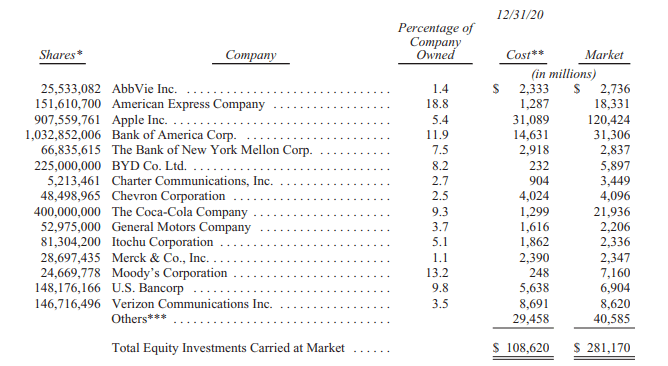

# 慢慢变富：巴菲特致股东信 1957～2021 年全集

*一夜暴富，和慢慢暴富，你选择哪一个？*

**股神似乎不再「神」了。**

巴菲特公司的股价在过去一年、五年和十年的表现，都不如美股大盘。

巴菲特终于开始改变对科技股的态度，在「买错」IBM 之后，重仓了看起来没什么想象力的苹果。

当然，在他漫长的投资历程中，10 年只是一个很小的衡量尺度。

《巴菲特超越价值》作者简恩认为：

> 如果置于长期视野下，价值投资可能就是「战无不胜」的，但在某一个时期，它显然未必如此，这就更需要有足够的耐心。

如果置于长期视野下，价值投资可能就是「战无不胜」的，但在某一个时期，它显然未必如此，这就更需要有足够的耐心。

概括而言，在市场下跌周期，价值投资的作用比较明显，但在上涨周期（例如过去十年），价值投资的表现未必很强，但也不会差很多。

一个普通人如果早年花 1000 美元买巴菲特的公司股票，现在大约值两千多万美金。

这算得上暴富了。

然而，多少人能够如此跨越大半个世纪？

也有人会说，你买比特币也可以爆赚一万倍啊。

的确，巴菲特是靠「慢慢暴富」，成为世界首富的。

*巴菲特99% 的净身家都是 50 岁以后挣得；**巴菲特近 96% 的财富在 60 岁以后才拥有。*

*一夜暴富*，和*慢慢暴富*，你选择哪一个？

巴菲特已经 90 岁了，未必有机会再次证明「价值投资」的魔力，他也不必。

*而你还年轻。*

**在这样一个追求十倍、百倍回报的时代，价值投资还有用吗？**

广义而言，一切投资都是价值投资。

重仓苹果股票的人，和 All in 比特币的人，可能都觉得自己是价值投资者。

差异也许在于：

* 对价值的定义；
* 对价值的评估；
* 对价值的实现。

对价值的定义；

对价值的评估；

对价值的实现。

所以，我们可以将巴菲特的价值投资，称为狭义价值投资。

价值投资的理念只有四个：

1. 买股票就是买公司；
1. 「利用」市场先生的情绪；
1. 安全边际；
1. 能力圈。

买股票就是买公司；

「利用」市场先生的情绪；

安全边际；

能力圈。

前三个都是巴菲特的老师本杰明·格雷厄姆的概念。

不过，有趣的是，巴菲特和芒格第一次见面，就是吐槽自己老师的理念。

后来，受芒格影响，巴菲特开始用不那么便宜的价格买好的公司。

所以，即使是狭义价值投资，也是在不断演变的。

但是，价值投资的四个基本理念，的确可以作为投资的「元认知」。

本文不会展开讨论价值投资，而是分享巴菲特过去数十年的股东信。

*即使不看惊人的收益，这数十年的投资行为，就像是一场人生的艺术，令人感慨。*

*第一部分：*2021 年最新的巴菲特致股东信，来自新浪财经的翻译。 *第二部分：*巴菲特致股东的信 1957～2018 中英文整理，来自网络。 *第三部分：*巴菲特的一些精彩话语。来自某百科。

伯克希尔·哈撒韦公司致股东：

根据美国公认会计准则（GAAP），伯克希尔 2020 年的盈利为 425 亿美元。这一数字的四个组成部分是 219 亿美元的营业利润，49 亿美元的实现资本利得，我们持有的股票中存在的净未实现资本利得增加所带来的 267 亿美元收益，最后，我们拥有的一些子公司和附属公司的价值减记导致的 110 亿美元损失。所有项目均在税后基础上列示。

营业利润是最重要的，即使它们不是我们公认会计准则总额中最大的项目。我们在伯克希尔的重点是增加我们的这部分收入和收购大的处于有利位置的企业。但去年，我们两个目标都没有实现：伯克希尔没有进行大规模收购，营业利润下降了 9%。不过，通过保留收益和回购约 5% 的股票，我们确实提高了伯克希尔的每股内在价值。

与资本利得或损失（无论是已实现或未实现）相关的两个公认会计准则组成部分每年都在反复波动，这反映了股票市场的波动。无论今天的数据如何，我和我的长期合作伙伴查理·芒格都坚信，随着时间的推移，伯克希尔的投资收益将是可观的。

正如我多次强调的那样，查理和我将伯克希尔持有的上市股票（截至去年年底价值 2810 亿美元）视为一个企业集合。我们并不控制这些公司的运营，但我们确实按比例分享了它们的长期繁荣。然而，从会计角度来看，我们的那部分利润并没有包括在伯克希尔的收益中。相反，只有这些被投资方支付给我们的股息才会被记录在我们的账簿上。根据公认会计准则，被投资方代表我们保留的巨额资金也变成无形资产。

然而，这些看不见的东西不应该被忽视：这些未记录的留存收益通常为伯克希尔创造价值——大量价值。被投资方利用这些留存资金来扩大业务、进行收购、偿还债务，通常还会回购股票（这种行为增加了我们在他们未来收益中所占的份额）。

正如我们在去年的股东信中指出的那样，留存收益在整个美国历史上推动了美国企业的发展。对卡内基和洛克菲勒行之有效的方法多年来对数百万股东也行之有效。

当然，我们的一些投资人会令人失望，他们留存的收益几乎没有增加他们公司的价值。但其他公司会超额完成任务，其中少数公司表现出色。总而言之，我们预计自己在伯克希尔非控股业务（别人会认为是我们的股票投资组合）留存的巨额收益中所占的份额，最终会给我们带来等量或更多的资本利得。在我们 56 年的任期中，这一期望一直得到满足。

我们 GAAP 数据的最后一个组成部分——丑陋的 110 亿美元减记——几乎是全部量化我在 2016 年犯的一个错误。那一年，伯克希尔收购了精密铸件公司（Precision Castparts，「PCC」），我付了太多的钱。

没有人以任何方式误导我——我只是对 PCC 的正常盈利潜力过于乐观。去年，作为 PCC 最重要的客户来源，整个航空航天业的不利发展，暴露了我的误判。

在收购 PCC 的过程中，伯克希尔收购了一家很好的公司，同行业中最好的一家。PCC 的首席执行官马克·多尼根是一位充满激情的经理，他一如既往地将同样的精力投入到我们收购的业务中。我们很幸运有他来管理。

我认为我的结论是正确的，PCC 将随着时间的推移，在其运营中部署的净有形资产上获得良好的回报。然而，我对未来收益的判断是错误的，因此，我也就错误地计算出了为收购该企业支付的合理价格。

PCC 远非我犯下的第一个错误。但这是一个大错误。

## 我们的弓上有两根弦

伯克希尔哈撒韦经常被贴上「综合企业集团」的标签，这是一个贬义词，指的是拥有大量不相关业务的控股公司。是的，这是对伯克希尔正确的描述——但只是部分描画。为了更好理解我们如何以及为什么不同于其他综合性企业集团，让我们回顾一下历史。

长期以来，综合企业集团通常会局限于收购整个企业。然而，这一战略带来了两个大问题。有一个问题是无解的：大多数真正伟大的企业都无意让别人接管。因此，渴望收购的企业集团不得不专注于那些缺乏重要和持久竞争优势的一般公司。那不是一个钓鱼的好池塘。

除此之外，当联合企业不得不收购平庸的公司时，他们常常发现自己需要支付惊人的「控制权」溢价，以诱捕他们的猎物。一些精明的企业集团知道如何解决这个「超额支付」的问题：他们只需让自己公司估值变得高得离谱，来作为昂贵收购的「货币」。（「我愿意花1万美元买你的狗，做法是把我单价 5000 美元的两只猫给你。」）

通常，让综合企业集团股票估值过高的手段包括促销和「富有想象力的」会计操作，这些手段充其量是欺骗性的，有时甚至会越界成为欺诈。当这些招数「成功」时，这家集团会将自己的股价推至商业价值的三倍，以便收购估值是实际价值两倍的目标公司。

投资幻想可以持续相当长的时间。华尔街喜欢并购交易产生的费用，而媒体则喜欢精彩的推介者提供的故事。同样，有时候，一只被推销的股票飙升的价格本身也可以成为投资幻想就是现实的「证据」。

最终，当然，盛宴结束，许多商业「皇帝」没穿衣服。金融历史上充斥着许多著名企业集团的名字，这些企业家最初被记者、分析师和投资银行家誉为商业天才，但后来却被抛进商业垃圾场。

大集团声名狼藉。

芒格和我希望我们的企业集团拥有具有良好财务状况和优秀经理人的多元化企业集团的全部或部分，而伯克希尔是否控制这些业务对我们来说并不重要。

我花了好一会儿才明白过来。但是芒格，还有我在伯克希尔继承的纺织业务中苦苦挣扎的 20 年经验，最终说服了我，拥有一个很棒的企业的不控股股权，要比拥有控股 100% 的挣扎在边缘企业更有利可图，更愉快，更少工作量。

基于这些原因，我们的企业集团将继续由可控的和非可控的业务组成。芒格和我会根据一家公司持久的竞争优势，管理能力和特点，以及价格，将资金配置到我们认为最合理的地方。

如果这一战略不需要我们付出多少努力，那就更好了。与跳水比赛使用的计分系统不同，你在商业活动中不会因为有「难度」而得分。此外，正如罗纳德·里根告诫的那样：「据说努力工作不会导致死亡，但我要说为什么要冒这个险呢？」

## 家族的珠宝以及我们如何增加你的珠宝份额

在 A-1 页，我们列出了伯克希尔旗下的子公司，这些公司在去年年底雇佣了 36 万名员工。 　　 您可以在本报告后面的 10-K 中阅读到更多关于这些控股公司的信息。我们主要的头寸集中在我们拥有少量股权，但不控股的公司，这些公司列在这封信的第7页。这部分也同样非常庞大和多样化。

然而，伯克希尔的大部分价值存在于四大业务，其中三大业务为我们的控股业务，我们仅持有第四大业务 5.4% 的股权。四大业务都是珠宝。

价值最大的是我们的财产/意外险业务，53 年来一直是伯克希尔的核心业务。我们的保险家族在保险领域是独一无二的。它的负责人 Ajit Jain 在 1986 年加入了伯克希尔哈撒韦公司，他也是独一无二的。

总的来说，我们保险业务的运营资金远远超过其全球竞争对手。我们的财务实力，加上伯克希尔每年从其非保险业务中获得的巨额现金流，使我们的保险公司能安全地遵循以购买股票为主的投资策略，这对绝大多数保险公司来说是不可行的。那些保险公司，出于监管和信用评级的原因，必须以购买债券为主。

现在债券并不是好的投资标的。你能相信最近 10 年期美国国债的收益率是 0.93%——比 1981 年 9 月的 15.8% 的收益率下降了 94% 吗？在某些重要的大国，如德国和日本，投资者从数万亿美元的主权债务中获得负回报。全球范围内的固定收益投资者——无论是养老基金、保险公司还是退休人员——都面临着暗淡的未来。

一些保险公司，以及其他债券投资者，可能会试图通过将购买转移到由不稳定的借款人支持的债券，来为目前可怜的回报提供动力。然而，高风险贷款并不是解决利率不足问题的办法。30 年前，一度强大的储蓄和贷款行业毁了自己，部分原因是忽视了这条箴言。

伯克希尔现在拥有 1380 亿美元的保险「浮动」资金——这些资金不属于我们，但我们可以配置，无论是配置债券、股票还是美国国库券等现金等价物。浮动资金与银行存款有一些相似之处：保险公司每天都有现金进进出出，但保险公司持有的现金总额变化很小。伯克希尔持有的巨额资产很可能会在未来许多年保持在目前的水平，而且从累计角度看对我们来说是没有成本的。当然，这个令人高兴的结果可能会改变——但是，随着时间的推移，我会喜欢我们的胜算。

在我每年给你们的信中，我已经重复地——有些人可能会说没完没了地——解释了我们的保险业务。因此，今年我会请希望更多了解我们保险业务和「浮动资金」的新股东阅读 2019 年报告的相关部分，今年再次刊发在 A-2 页。重要的是您要了解我们从事保险业务所存在的风险和机会。

我们第二和第三大最有价值的资产是伯克希尔对以货运量计美国最大铁路公司 BNSF 的 100% 持股，以及我们对苹果公司 5.4% 的持股。排名第四的是我们持有 91% 的伯克希尔·哈撒韦能源公司（BHE）。这是一个非常不同寻常的公用事业公司，在我们拥有它的 21 年里，它的年收入从 1.22 亿美元增长到了 34 亿美元。

关于 BNSF 和 BHE 在这封信后面我将做更多说明。然而，现在，我想把重点放在伯克希尔会定期使用的一种做法上，以提高你对它的「四大资产」以及伯克希尔拥有的许多其他资产的兴趣。

去年，我们花 247 亿美元回购了相当于 80,998 股伯克希尔哈撒韦 A 股的股票，对伯克希尔的资产扩张表现出了热情。这一行动使你们在伯克希尔旗下所有企业的持股比例增加了 5.2%，而你们根本不需要动用你们的钱包。

按照查理和我长期以来推荐的标准，我们进行了这些回购，因为我们相信，它们既能持续提高持股人的每股内在价值，也能让伯克希尔拥有充足的资金来应对可能遇到的任何机会或问题。

我们绝不认为伯克希尔的股票应该以任何价格回购。我之所以强调这一点，是因为美国的 CEO 们有过这样一个尴尬的记录：在股价上涨时，他们投入更多公司资金用于回购，而不是股价下跌时。我们的做法恰恰相反。

伯克希尔对苹果的投资生动地说明了回购的力量。我们从 2016 年末开始购买苹果股票，到 2018 年 7 月初，我们持有的苹果股票（经拆股调整后）略多于 10 亿股。说到这里，我指的是伯克希尔总账户中持有的投资，而不包括随后被出售的非常少的、单独管理的苹果股票。当我们在 2018 年年中完成购买时，伯克希尔的一般账户持有苹果 5.2% 的股份。

我们的投资成本是 360 亿美元。从那以后，我们都享受了定期股息，平均每年约 7.75 亿美元，而且在 2020 年，通过出售我们头寸的一小部分，我们还获得了额外的 110 亿美元。

尽管有出售——你们瞧！——伯克希尔目前仍持有苹果 5.4% 的股份。这一增长对我们来说是没有成本的，因为苹果一直在回购其股票，从而大幅减少了目前的流通股票数量。

但这远不是所有的好消息。因为我们还在两年半内回购了伯克希尔的股票，你现在间接拥有的苹果资产和未来收益比 2018 年 7 月整整多 10%。

这种令人愉快的动态仍在继续。伯克希尔自去年底以来回购了更多股票，并且将来可能会进一步减少其股票数量。苹果也公开表示有意回购其股票。随着流通股的减少，伯克希尔的股东不仅将在我们的保险集团、BNSF（北伯林顿铁路公司）和 BHE（伯克希尔·哈撒韦能源公司）中拥有更大的利益，而且还会发现他们对苹果的间接所有权也在增加。

回购的数学看似缓慢，但随着时间的推移会产生强大的力量。该过程为投资者提供了一种简单的方式，让他们拥有不断扩大的企业份额。正如性感女星梅·韦斯特（Mae West）向我们保证的那样：「太多的好东西都可以是美好的」。

## 投资

下面我们列出了 15 笔年底市值最大的普通股投资。我们排除了卡夫亨氏的持股——325,442,152 股——因为伯克希尔是一个控股集团的一部分，因此必须使用「权益」法来计算这笔投资。在伯克希尔的资产负债表上，卡夫亨氏持有的卡夫亨氏资产按公认会计准则计算为 133 亿美元，这一数字代表伯克希尔在 2020 年 12 月 31 日经审计的卡夫亨氏资产净值中所占的份额。但请注意，2020 年 12 月 31 日我们这些股票的市值只有 113 亿美元。

*注：*

* 不包括伯克希尔旗下子公司的养老基金持有的股票。
* 这是我们的实际购买价格，也是我们的计税依据。
* 包括对西方石油公司（Occidental Petroleum）的 100 亿美元投资，包括优先股和购买普通股的认股权证，目前组合估值为 90 亿美元。

不包括伯克希尔旗下子公司的养老基金持有的股票。

这是我们的实际购买价格，也是我们的计税依据。

包括对西方石油公司（Occidental Petroleum）的 100 亿美元投资，包括优先股和购买普通股的认股权证，目前组合估值为 90 亿美元。

## 双城记

在美国，成功的故事俯拾皆是。自我们国家诞生以来，那些有理想、有抱负，但往往只有微薄资本的人，通过创造新东西或用旧东西改善顾客体验，取得了超出他们梦想的成功。

查理和我曾游历全美，与这些人或他们的家人相遇。在西海岸，我们从1972年收购喜诗糖果（See’s Candy）开始了这一惯例。整整一个世纪前，玛丽·时思（Mary See）开始推出一种古老的产品，她用特殊的配方对其进行了改造。除了她的商业计划之外，她还开设了一些古色古香的商店，里面有友好的销售人员。她在洛杉矶开的第一家小专卖店最终发展成了几百家商店，遍布整个西部。

今天，时思女士的作品继续令客户感到愉悦，同时为成千上万的男女提供终身就业机会。伯克希尔的工作就是不干涉公司的成功。当企业生产和分销一种非必需的消费品时，客户就是老板。而且，100 年后，客户向伯克希尔传递的信息依然清晰：「不要乱动我的糖果。（喜诗糖果的网址是 https：//www.sees.com/，可以试试他们的花生糖。）

接下来让我们跨越大陆来到华盛顿特区。1936 年，利奥·古德温和他的妻子莉莲开始相信，汽车保险——一种通常从代理商那里购买的标准化产品——可以直接以低得多的价格出售。两人怀揣 10 万美元，与拥有 1000 倍甚至更多资本的大型保险公司展开了较量。政府雇员保险公司（后来简称为 GEICO）由此开始了其漫漫征程。

幸运的是，我在整整 70 年前就了解到了这家公司的潜力。它立刻成为了我的初恋（在投资方面）。接下来的故事大家都知道了：伯克希尔最终 100% 拥有了 GEICO，这家 84 岁年历史公司一直在微调，但没有改变利奥和莉莲的愿景。

当然，该公司的规模发生了变化。1937 年，也就是 GEICO 运营的第一个整年，其完成了 238,288 美元的业务。去年的数字是 350 亿美元。

今天，沿海地区汇聚了大量金融、媒体、政府和科技机构，人们很容易忽视美国中部发生的很多奇迹。让我们关注两个社区，它们为我们全国各地的人才和雄心提供了令人惊叹的例证。

我从奥马哈开始，你们不会感到奇怪。1940 年，毕业于奥马哈中心高中（也是查理、我父亲、我第一任妻子、我们的三个孩子和两个孙儿的母校）的杰克·林格沃特（Jack Ringwalt）决定用 12.5 万美元的资本创办一家财产（意外伤害）保险公司。

杰克的梦想似乎是荒谬的，因为这要求他的小公司——有点浮夸地被命名为国民保险公司（National Indemnity）——与大型保险公司竞争，而这些公司都拥有充足的资本。此外，这些竞争对手凭借遍布全国的、资金雄厚的、历史悠久的当地代理商网络而牢固地确立了自己的地位。

在杰克的计划中，与 GEICO 不同的是，国民保险公司本身会使用任何屈尊接受它的机构，因此在收购业务时没有成本优势。为了克服这些可怕的障碍，国民保险将重点放在了被大公司认为不重要的「古怪」风险上。不可思议的是，这一策略成功了。

杰克诚实、精明、讨人喜欢，还有点古怪。他尤其不喜欢监管机构。每当他对他们的监督感到厌烦时，他就会有卖掉公司的冲动。

幸运的是，有一次我就在附近。杰克想加入伯克希尔，于是我们在 1967 年达成了交易，只用了 15 分钟就达成了。我从没要求过审计。

今天，国民保险公司是世界上唯一一家愿意为某些巨大风险承保的公司。是的，它的总部仍然在奥马哈，距离伯克希尔的总部只有几英里。

多年来，我们又从奥马哈家族手中收购了四家企业，其中最著名的是内布拉斯加州家具市场（NFM）。该公司的创始人罗斯·布卢姆金（Rose Blumkin，B 夫人）是俄罗斯移民，在 1915 年来到西雅图，她既不会读也不会说英语。几年后，她定居在奥马哈。在 1936 年，她攒下了 2500 美元，用这笔钱开了一家家具店。

竞争对手和供应商忽视了她，而他们的判断在当时无疑是正确的：第二次世界大战让她的生意停滞了。在 1946 年底，公司的净资产仅增长到 72,264 美元。现金，不论是在收银台里还是在存款里，总共是 50 美元（没有打错字）。

然而，有一笔无价的财富没有在 1946 年的数字中记录下来：B夫人唯一的儿子路易-布卢姆金（Louie Blumkin）在美国军队服役四年后重新加入了这家商店。在诺曼底登陆后，路易参加了诺曼底奥马哈海滩的战斗，并因在 Bulge 战役中受伤而获得了紫心勋章，最终在 1945 年 11 月乘船回国。

一旦 B 夫人和路易重聚，就没有什么能阻止这家家具店的发展了。在梦想的驱使下，母亲和儿子不分昼夜地工作。其结果是创造了零售业的一个奇迹。

到 1983 年，两人已经让家具店的业务规模达到了 6000 万美元。那一年，在我生日那天，伯克希尔收购了 NFM 80% 的股份。同样，我们没有对这家家具店进行审计。我指望布卢姆金的家族成员来经营企业。今天，NFM 正由第三代和第四代布卢姆金的家族成员管理着。需要指出的是，B 夫人每天都在工作，直到 103 岁——在查理和我看来，这是一个可笑的过早退休年龄。

NFM 目前拥有美国最大的三家家居用品商店，尽管NFM的门店因新冠关闭了疫情六周多，但这三家商店在 2020 年都创下了销售记录。

这个故事的后记说明了一切：每当 B 夫人的一大家子人聚在一起过节吃饭时，她总是要求他们在吃饭前唱首歌。她的选择从未改变过：欧文·柏林（Irving Berlin）的《上帝保佑美国》（God Bless America）。

让我们向东转移到田纳西州的第三大城市诺克斯维尔。在那里，伯克希尔拥有两家引人注目的公司——克莱顿住宅（Clayton Homes）（100% 持股）和 Pilot Travel Centers（目前持股 38%，但到 2023 年将达到 80%）。

每一家公司都是由一位毕业于田纳西大学并留在诺克斯维尔的年轻人创立的。这两个年轻人都没有足够的资金，父母也不富裕。

但是，那又怎样？如今，克莱顿和 Pilot 的每人的年税前利润都超过了 10 亿美元。这两家公司共雇用了大约 4.7 万名男女员工。

吉姆·克莱顿（Jim Clayton）在经历了几次商业冒险之后，于 1956 年以小本经营的方式创建了克莱顿住宅（Clayton Homes）。1958 年，「大个子吉姆」（Big Jim Haslam）以 6000 美元的价格购买了一个服务站，创建了后来的 Pilot Travel Centers。后来，他俩的儿子也都加入了他们的父亲的公司，他们的儿子有着和他们父亲一样的激情、价值观和头脑。有时候基因太有魔力了。

现年 90 岁的「大吉姆」Haslam最近写了一本鼓舞人心的书，他在书中讲述了 Jim Clayton 的儿子 Kevin 是如何鼓励 Haslam 家族将大部分的 Pilot Travel Centers 卖给伯克希尔的。每个零售商都知道满意的顾客是商店的最佳销售人员。当企业易手时也是如此。

当您下次飞越诺克斯维尔或奥马哈时，向 Clayton 家族、Haslam 家族和 Blumkin 家族，以及遍布全国各地的成功企业家们脱帽致敬吧。这些创造者需要美国的繁荣框架（它始于 1789 年进行的一次独特实验）才能发挥潜力。反过来，美国需要像这些杰出的公民来实现我们开国元勋所追求的奇迹。

如今，许多人在世界各地创造了类似的奇迹，创造了使全人类受益的繁荣。然而，在其短暂的 232 年中，还没有其他像美国这样可以释放人类潜能的孵化器。尽管出现了严重的中断，但我国的经济发展却令人叹为观止。

除此之外，我们保留着成为「更完美联盟」的宪政愿望。在这方面的进展缓慢，不平衡且经常令人沮丧。但是，我们已经向前迈进，并将继续前进。

我们坚定的结论：绝不与美国作对赌。

## 伯克希尔的伙伴关系

伯克希尔是特拉华州的一家公司，我们的董事必须遵守该州的法律。其中包括要求董事会成员必须为公司及其股东的最佳利益行事。我们的董事们拥护这一原则。

此外，伯克希尔公司的董事当然希望公司能取悦客户，发展和奖励其 36 万名员工的才能，与放贷人的往来光明正大，并在许多我们运营业务的城市和州被视为良好公民。我们重视这四个重要的群体。

但这些团体中，没有任何一个团体在确定诸如股息、战略方向，首席执行官人选、并购和资产剥离之类的事情上有投票权。这些方面的责任完全是伯克希尔公司董事们的责任，他们必须忠实地代表公司及其所有者的长期利益。

除了法律要求之外，查理和我还对伯克希尔的许多个人股东负有一种特殊的义务。一些个人经历可能会帮助您了解我们不寻常的关系，以及它何影响我们的行为。

在我执掌伯克希尔之前，我通过一系列合伙企业为许多个人管理资金，其中最早的 3 家合伙企业成立于 1956 年。随着时间的流逝，同时运营多个实体变得难以控制，在 1962 年，我们将 12 个合伙企业合并为一个独立的实体，即巴菲特合伙有限公司（Buffett Partnership Ltd. 简称 BPL）。

到那一年，几乎所有我自己的钱，以及我妻子所有的钱，都一起投入了我的许多有限合伙公司的基金。我没有薪水，也没有费用收入。相反，作为普通合伙人，我的有限合伙公司只有在他们获得的年度回报率高于 6% 的门槛之后，才会给我报酬。如果收益未能达到该水平，差额部分就从我未来的应得利润中扣除。（幸运的是，从未发生过这种事：合伙人回报率总是超过 6% 的「标准杆」。）随着岁月的流逝，我父母、兄弟姐妹、姨妈姑婶、叔叔舅舅、表兄弟和姻亲都将大部分资金投资给了上述合伙企业。

查理在 1962 年成立了合伙公司，运作方式和我差不多。我们都没有任何机构投资者，我们的合作伙伴中也很少有金融行家。那些加入我们公司的人相信我们会像对待自己的钱一样对待他们的钱。这些人——要么凭直觉，要么依靠朋友们的建议——正确地得出了这样的结论：查理和我对资本的永久亏损有着极端的厌恶，除非我们预期他们的钱会做得相当不错，否则我们不会接受他们的钱。

1965 年 BPL 收购伯克希尔哈撒韦的控制权后，我无意中进入了企业管理领域。后来，在 1969 年，我们决定解散 BPL。年底后，这家合伙企业按比例分配了所有现金和三支股票，其中价值最高的是 BPL在伯克希尔哈撒韦的 70.5% 股权。

与此同时，查理在 1977 年结束了其公司的运营。在他分配给合伙人的资产中，有 Blue Chip Stamps 的主要股份，这是他的合伙人、伯克希尔和我共同控制的一家公司。Blue Chip 也是我的合伙公司解散时分配的三支股票之一。

1983 年，伯克希尔和 Blue Chip 合并，使伯克希尔的注册股东基础从 1900 人扩大到 2900 人。查理和我希望所有人——新老股东和潜在股东——都能步调一致达成共识。

因此，在 1983 年的年报中——首当其冲——列出了伯克希尔的「主要商业原则」。第一条原则这样开始：「虽然我们的形式是公司，但我们的态度是合作关系。」「这定义了我们在 1983 年的关系，这样是我们对今天的定义。查理和我——以及我们的董事们——相信这句格言在未来几十年里将对伯克希尔大有裨益。

伯克希尔的所有权现在分为五个大「桶」，其中一个由我作为「创始人」占据。那一桶肯定会空，因为我拥有的股票每年都会分配给各种慈善机构。

其余四桶中有两桶由机构投资者占据，各自负责管理他人的资金。然而，这就是这两个桶之间的不同之处：它们的投资程序截然不同。

一个机构类型是指数基金，这是投资界一个规模庞大、迅速发展的领域。这些基金只是紧跟它们追踪的指数。指数投资者最喜欢的是标普500指数（S&P 500），伯克希尔哈撒韦是该指数的成份股。应该强调的是，指数基金之所以持有伯克希尔的股票，只是因为它们被要求这么做。他们处于自动驾驶状态，买卖只是为了「权重」目的。

另一个机构类型则是管理客户资金的专业人士，不管这些资金属于富人、大学、退休人员或任何人。这些职业经理人的职责是根据他们对估值和前景的判断，将资金从一项投资转移到另一项投资。这是一个光荣而艰难的职业。

我们很高兴为这个「活跃的」团体工作，同时他们也在寻找更好的地方来配置客户资金。可以肯定的是，一些基金经理着眼长远，很少进行交易。还有一些人使用计算机，利用算法可以在一纳秒内指导股票的买卖。一些专业投资者会根据他们的宏观经济判断来回操作。

第四类是个人股东，他们的运作方式与我刚才描述的积极型机构经理人类似。可以理解的是，当这些股东看到另一项令他们兴奋的投资时，他们会把自己持有的伯克希尔股票视为可能的资金来源。我们对这种态度没有异议，这与我们看待我们在伯克希尔持有的一些股票的方式类似。

综上所述，如果查理和我对我们的第五桶没有特别的亲缘感，那我们就没有人性了。第五桶就是超过百万的个人投资者，他们相信我们会代表他们的利益，不管未来会发生什么。他们加入我们并不打算离开，他们的心态与我们最初的合作伙伴相似。事实上，在我们合伙期间的许多投资者，以及/或他们的后代，仍然是伯克希尔的主要所有者。

斯坦·特鲁尔森（Stan Truhlsen）就是这些老合作伙伴中的一个典型代表，他是奥马哈市一位开朗慷慨的眼科医生，也是一位私人朋友，他在 2020 年 11 月 13 日迎来了自己的 100 岁生日。1959 年，斯坦和其他 10 名年轻的奥马哈医生与我结成了伙伴关系。他们创造性地将自己的公司命名为 Emdee,Ltd。每年，他们都会和我和妻子一起在家里举行庆祝晚餐。

当我们的合伙人在 1969 年分配伯克希尔股票时，所有的医生都保留了他们得到的股票。他们可能不知道投资或会计的来龙去脉，但他们知道在伯克希尔他们将被视为合伙人。

斯坦的两名来自 Emdee 的朋友现龄都 90 多岁了，他们仍然持有伯克希尔的股票。这一群体惊人的持久性——加上查理和我分别是 97 岁和 90 岁的事实——提出了一个有趣的问题：持有伯克希尔的股票会让人长寿吗？

伯克希尔不同寻常且备受重视的个人股东家族，可能会让你更加理解我们不愿讨好华尔街分析师和机构投资者。我们已经有了我们想要的投资者，总的来说，我们不认为他们会被通过替代品来升级。

可供伯克希尔拥有的席位有限，也就是流通股。我们非常喜欢已经拥有了它们的人。

当然，「合伙人」也会发生一些变动。不过，查理和我希望这种变动很微小。毕竟，谁会寻求朋友、邻居或婚姻的快速转变呢？

1958 年，菲尔·费舍尔写了一本关于投资的极好的书。在这篇文章中，他将经营一家上市公司比作经营一家餐厅。他说，如果你在寻找食客，无论是汉堡配可乐还是带有异国情调的葡萄酒配法国美食，你都可以吸引顾客并获得成功。但是，费雪警告说，你不能随意地从一个口味转换到另一个：你给潜在客户的信息必须与他们进入你的场所后发现的一致。

在伯克希尔，我们提供汉堡和可乐已经 56 年了。我们珍惜这一票价所吸引的顾客。

美国和其他地方的数千万其他投资者和投机者有各种各样的股票选择，以符合他们的口味。他们将会找到拥有诱人想法的首席执行官和市场专家。如果他们想要价格目标，管理收益和「故事」，他们不会缺少追求者。「技术人员」将充满信心地指导他们，告诉他们图表上的一些波动预示着股票的下一步走势。要求采取行动的呼声永远不会停止。

我要补充的是，这些投资者中的许多人会做得很好。毕竟，持有股票在很大程度上是一个「正和」博弈。事实上，一个耐心且头脑冷静的猴子，通过向标普500的上市公司投掷 50 支飞镖构建的投资组合，随着时间的推移，只要它不受诱惑改变原来的「选择」，它就将会享受股息和资本收益。

生产性资产，如农场、房地产，当然还有企业所有权，都能产生财富——大量的财富。大多数拥有这些资产的人都会得到回报。所需要的只是时间的流逝、内心的平和、充足的多元化以及交易和费用的最小化。不过，投资者决不能忘记，他们的支出就是华尔街的收入。而且，和我的猴子不一样，华尔街的人可不是为了花生而工作的。

当伯克希尔有空位时——我们希望这样的空位很少——我们希望它们能被那些了解并渴望我们所提供的东西的新来者所占据。经过几十年的管理，查理和我仍然不能承诺结果。然而，我们可以并确实保证将你们视为合作伙伴。

我们的后继者也会如此。

## 伯克希尔的一个可能令你吃惊的数字

最近，我了解到一个我从未怀疑过的关于我们公司的事实：伯克希尔拥有的位于美国的房地产、工厂和设备——这类资产构成了我们国家的「商业基础设施」——它们的公认会计准则估值超过了任何其他美国公司所拥有的数量。伯克希尔的这些国内「固定资产」的折旧成本为 1540 亿美元。紧随其后的是 AT&T，其拥有的房地产、厂房和设备价值 1270 亿美元。

我应该补充一点，我们在固定资产所有权方面的领导地位，其本身并不意味着投资的胜利。最好的结果出现在那些只需要很少资产就能开展高利润业务的公司，以及那些提供只需要很少额外资本就能扩大销售额的产品或服务的公司。事实上，我们拥有一些这样的杰出企业，但他们相对较小，发展也比较缓慢。

然而，重资产的公司可以是很好的投资。事实上，我们很高兴看到我们的两大巨头——BNSF 和 BHE。2011 年，也就是伯克希尔拥有 BNSF 的第一个整年，这两家公司的利润合计为 42 亿美元。2020 年，对很多企业来说都是艰难的一年，但这两家公司却赚了 83 亿美元。

BNSF 和 BHE 在未来几十年将需要大量的资本支出。好消息是，两者都可能带来适当的增量投资回报。

让我们先看看 BNSF。它的铁路运输了美国境内所有非本地货物（按吨英里计算）的 15%，无论是通过铁路、卡车、管道、驳船还是飞机。BNSF 的负载远远超过任何其他承运人。

美国铁路的历史很有趣。在经历了 150 年左右的疯狂建设、欺诈、过度建设、破产、重组和合并之后，铁路行业终于在几十年前成熟并合理化了。

BNSF 于 1850 年开始运营，在伊利诺伊州东北部修建了一条 12 英里长的线路。如今，BNSF 有 390 个前身，他们的铁路被收购或合并。这家公司广泛的血统分布可以参看[这个链接](http://www.bnsf.com/bnsf-resources/pdf/about-bnsf/History_and_Legacy.pdf．)。

伯克希尔在 2010 年初收购了 BNSF。自从被我们收购以来，这家铁路公司在固定资产上投资了 410 亿美元，超过了折旧费用 200 亿美元。铁路是一项户外运动，火车必须在极冷和极热的环境下可靠地行驶，因为它们总是会遇到从沙漠到山脉的各种地形。大规模洪水周期性发生。BNSF 拥有 23000 英里的铁路，遍布 28 个州，必须不惜一切代价在其庞大的系统中最大限度地提高安全性和服务。

尽管如此，BNSF（北伯林顿铁路公司）还是向伯克希尔支付了大量股息——总计 418 亿美元。然而，铁路公司只会在满足其业务需求和保持 20 亿美元现金余额后，再付给我们剩下的钱。这种保守的政策允许 BNSF 以较低的利率借款，而不依赖伯克希尔对其债务的任何担保。

关于 BNSF 的另一个点是：去年，该公司首席执行官卡尔·艾尔（Carl Ice）和他的二号人物凯蒂·法默（Katie Farmer）在控制开支方面做了出色的工作，同时克服了业务的严重低迷。尽管载货量下降了 7%，但这两位实际上使 BNSF 的利润率提高了 2.9 个百分点。卡尔如计划的那样，在年底退休了，凯蒂接任了首席执行官一职。因此，BNSF 的管理依然优秀。

与 BNSF 不同的是，BHE（伯克希尔·哈撒韦能源公司）不支付普通股股息，这在电力行业很不常见。我们拥有该公司 21 年了，这种斯巴达式的政策贯穿了整个时期。与铁路不同，我们国家的电力设施需要大规模的改造，最终的成本是惊人的。这一努力将在未来几十年吸收 BHE 的全部收入。我们欢迎挑战，相信增加的投资将得到适当的回报。

让我来告诉你 BHE 的一项努力——它承诺投入 180 亿美元，对已经过时的电网进行改造和扩建，这些电网现在正在向整个西部输送电力。BHE 在 2006 年开始这个项目，预计在 2030 年完成——是的，2030 年。

可再生能源的出现使我们的项目成为社会的必需品。从历史上看，长期以来盛行的燃煤发电都位于人口密集的地区。然而，新世界风能和太阳能发电的最佳地点往往是在偏远地区。当 BHE 在 2006 年评估情况时，对西部输电线路进行巨额投资已不是什么秘密。然而，在计算项目成本后，当时很少有公司或政府机构有财力接手。

应该指出的是，BHE 的决定是基于它对美国政治、经济和司法体系的信任。要获得可观的收入，需要投入数十亿美元。输电线路必须跨越各州和其他司法管辖区的边界，每个州都有自己的规则和选区。BHE 还需要与数百名土地所有者打交道，并与生产可再生能源的供应商和向客户输送电力的遥远的公用事业公司签订复杂的合同。竞争激烈的利益集团和旧秩序的捍卫者，以及渴望立即出现一个新世界的不切实际的梦想家，都必须加入进来。

惊喜和延迟都是肯定的。然而，同样可以肯定的是，BHE具备管理才能、机构承诺和财力来履行其承诺。虽然我们的西部输电项目要多年才能完成，但我们今天正在寻找其他类似规模的项目来承担。

无论遇到何种障碍，BHE 都将成为提供更清洁能源的领导者。

## 年度会议

去年 2 月 22 日，我写信告诉你，我们计划召开一个盛大的年会。不到一个月，这个计划就被废弃了。

由梅丽莎·夏皮罗（Melissa Shapiro）和伯克希尔首席财务官马克·汉伯格（Marc Hamburg）领导的总部小组迅速重组。他们的即兴表演奇迹般地奏效了。伯克希尔副董事长之一格雷格·阿贝尔（Greg Abel）和我一起上台，面对着一个黑暗的舞台、1.8 万个空座位和一台摄像机。没有彩排：我和格雷格在「表演时间」开始前 45 分钟到达。

我令人难以置信的助手 Debbie Bosanek 于 47 年前加入伯克希尔，当时她年仅 17 岁，她整理了约 25 张幻灯片，这些幻灯片展示了我在家中整理的各种事实和人物。幻灯片由一个匿名但非常能干的计算机和摄像头操作团队以适当的顺序投影到屏幕上。

雅虎将整个过程向创纪录的国际听众直播。CNBC 的 Becky Quick 在新泽西州的家中工作，在 Greg 和我上台的四个小时内，从观众通过她的电子邮箱提交的成千上万个问题中挑选出问题。See’s 花生脆和软糖，以及可口可乐，为我们提供食品。

今年，5 月 1 日，我们计划举办一次更好的活动。同样，我们将依靠 Yahoo 和 CNBC 完美无缺的表现。雅虎将于美国东部时间下午 1 点开始[直播](https://finance.yahoo.com/brklivestream)。

我们的正式董事会议将于美东时间下午 5:00 开始，应在下午 5:30 结束。在此之前，在 1:30～5:00 之间，我们将回答 Becky Quick 转交的问题。和往常一样，我们不知道问题是什么。将您有趣的话发送到 BerkshireQuestions@cnbc.com。雅虎直播将在 5:30 之后结束。

现在——此处应有掌声——惊喜来了。今年，我们的会议将在洛杉矶举行……而查理将会上台，在整个 3 个半小时的问答环节中回答问题并发表意见。去年（他没来）我想念他，更重要的是，你们显然也想念他。我们宝贵的副主席 Ajit Jain 和 Greg Abel 也将与我们一起回答有关其业务领域的问题。

欢迎通过 Yahoo 观看我们的会议。将您真正棘手的问题转给查理！我们会很开心的，希望您也一样。

当然，更好的是我们面对面相见的那一天，我希望并期待能在 2022 年相见。奥马哈市民、我们的参展子公司以及我们所有在总部工作的人，都迫不及待地希望您参加真正的伯克希尔式大会。

2021 年 2 月 27 日 沃伦·巴菲特董事会主席

由于字数限制，请点击阅读《[慢慢变富：巴菲特致股东信 1957～2021 年全集（2）](https://youzhiyouxing.cn/n/materials/614)》

> 来源：公众号「孤独大脑」转载文章发表的所有信息仅代表作者个人观点，不对您构成任何投资建议，详见[《文章免责声明》](https://youzhiyouxing.cn/agreements/ARTICLE_DISCLAIMER)。
