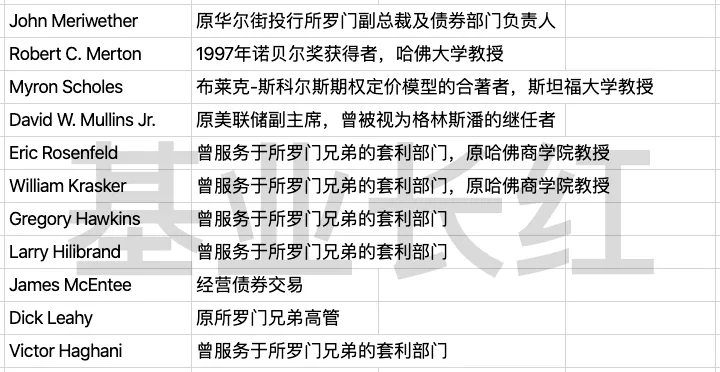

# 概率之外：多数人学不会的赔率思维

投资是基于概率和赔率的游戏。

所谓概率，指的是一个事件发生的可能性有多大；所谓赔率，指的是这件事发生后盈利或亏损的程度。好的投资是两个因素共同作用的。

用一个简单的公式来表达：投资收益 = 概率 x 赔率。

如果只注重概率，当遇到极端事件时可能会赔光；如果只注重赔率，那我们可能会浪费掉很多还不错的「积小胜为大胜」的投资机会。

因此，我们在投资中不能只注重一个因素而忽视另一个。

屠夫老师在这篇文章中用不同的例子向我们揭示了这个道理。长期资本死在了小概率发生但赔率足够大的事件上，而大空头 Michael Burry 和《黑天鹅》的作者纳西姆·塔勒布则是利用低概率但高赔率的事件赚了大钱。

左手概率，右手赔率。相信这篇文章能给你一些启发。

祝开卷有知。

邓肯·瓦茨：「我们总愿意对未来做出预测，却不愿意为自己做出的预测负责。」

金钱永不眠，屠夫问候各位早安。

去年年底写过一篇《决策与判断的误区》颇受欢迎，在雪球上超过 100 万阅读。

其实内容也没有多高深，只是以一个相对易懂的方式解释了「贝叶斯定律」和「无证据证明」这两件事，更多的是从「概率」的角度切入。

投资者必须看概率，又不能只看概率。

为什么必须看概率？不看概率的投资者，不过是赌徒。

为什么不只看概率？只看概率的投资者，目光会变得狭隘。

今天，咱们来聊聊概率之外的一件事：赔率。

「赔率」本意来自于博彩行业，这个概念我们完全可以迁移到投资上。

一年前写《不靠预测盈利》时，屠夫曾引用过《优势投资法则》的一个例子，或许可以帮你更好地理解「赔率」这件事。

世界杯决赛，德国对英格兰。赌球玩家们开始下注了：买德国队赢的资金合计有 120 万，买英格兰队赢的合计有 80 万。

如果你是庄家，你需要操控这场比赛来获利吗？你需要准确预测结果来获利吗？答案是：不需要。

赌局里有个因素叫「赔率」。赔率为 1.2，表示玩家投入 100 元，赌对了会拿到 120 元（包含 100 元下注本金）。

假设德国队赢的赔率是 X，根据上面的资金分布，德国队赢时庄家要支付的资金是 120 x X 万，赔给买德国队赢的玩家。

只需要保证120 x X < 120 + 80 ，即 X < 1.67，你就一定不会亏钱。

同样地，英格兰队赢的赔率是 Y，只需要保证 80 x Y < 120 + 80 ，即 Y < 2.5 ，你就不会亏钱。

当然咯，你还可以设定一点「安全边际」。把德国队赢的赔率设为 1.50，英国队赢的赔率设为 2.25：

> 德国队赢，你有 120 + 80 - 120 x 1.50 = 20 万利润；英国队赢，你有 120 + 80 - 80 x 2.25 = 20 万利润；决赛没有平局，无论哪边赢，你都能锁定 20 万。

德国队赢，你有 120 + 80 - 120 x 1.50 = 20 万利润；英国队赢，你有 120 + 80 - 80 x 2.25 = 20 万利润；决赛没有平局，**无论哪边赢**，你都能锁定 20 万。

换句话说，作为庄家的你，既不需要花钱操控比赛，也不需要雇佣团队进行预测，只需要做一道简单的算术题——无论结果如何，你的利润都是 100% 确定的。

较真的同学可能会问：下注金额是实时变化的，万一超出赔率的设定范围呢？

多亏了信息技术的发展，现代的博彩业大多采用了动态赔率——根据下注金额分布，实时调整赔率。

多数人误以为博彩公司要么操控比赛，要么靠「概率」赚钱，有赢有输。

殊不知，人家靠着「赔率」稳赚不赔。

美国长期资本管理公司，全称 Long-Term Capital Management (简称 LTCM)，曾经是聚集了投资大神和诺奖得主的梦幻组合。这个曾经的投资界梦之队有多厉害？看名单就知道了：

来源：百度百科

LTCM 的成员简历里能找到这些词汇：诺贝尔奖得主、美联储、所罗门兄弟……可是年轻一点的投资者，恐怕连 LTCM 的名字都没听过——因为他们仅仅存活了 7 年，就倒闭清算了。

聚集了这么多聪明人的公司，怎么就倒了呢？这得从他们的赚钱手法说起。复杂数学模型屠夫不谈，只解释核心。

LTCM 以「市场中性套利策略」形成了一套自动化投资系统，在 1994 年公司创建以后一路高歌。

这种策略虽然单次获利收益不高，但是获利**概率很大**，因此通过 LTCM **加杠杆**的办法扩大收益。

然而他们所使用的数学模型建立在历史数据之上，在统计过程中，一些小概率事件常常被忽略。**但是低概率叠加高赔率（杠杆)，产生了毁灭性的后果**。

20 世纪末，俄罗斯发生债务危机。押上**60 倍杠杆**的 LTCM，在 150 天内资产净值**下降 90%**！尽管美联储出面斡旋，美林、摩根等机构注资「续命」，LTCM 在 2000 年依然走向了破产清算的末路。

巴菲特将这件事形容为「推土机前捡硬币」——也许你身手敏捷、技艺高超、胆识过人，但是，不管你成功捡到多少枚硬币，只要被推土机撞上一次，你就完了。

美国房地产抵押贷款违约的可能性是多少？直到 2007 年之前，大部分人会想当然地回答：**零**。只有极少数独立思考者，嗅到了不对劲。

Scion 基金的掌舵人迈克尔·巴里（Michael Burry，以下简称「Burry」） 通过大量的调查和分析，发现了房地产抵押贷款里的巨大泡沫，而且坚信泡沫即将破灭。

可当时并没有专门针对房地产抵押贷款的做空工具，于是 Burry 博士发挥「没有条件就创造条件」的精神，游说各大投资银行为自己量身定做了 CDS，中文名为「信用违约互换」 (Credit Default Swap) 。

CDS 好比房地产抵押贷款的「保险」：当出现大量贷款**违约**时，持有者获得高额**赔偿**。

和保险一样，如果没有「出险」，持有者需要不断地缴纳「保费」，这也是 CDS 发行方的收益来源。但是和保险不同，持有者并不需要真的持有 CDS 对应的房地产抵押贷款。

**换句话说，CDS 更像是押在房地产抵押贷款上的「对赌工具」**。

现在我们当然知道，房地产抵押贷款可能违约甚至引发金融危机，但当时的主流观点是：房地产抵押贷款，永远不可能违约——至少，违约是概率极低的事。

低概率给空头们带来一个便利：CDS 的「保费」相当低，毕竟是小概率事件嘛。所以他们可以靠充足的现金，熬到泡沫破灭的那一天。

那天确实到来了，他们获得了超高赔率的回报。

感兴趣的同学可以找找这部电影，或者通过屠夫写的《用尽一生等一回的交易》领略其中奥妙。

喜欢押注「低概率高赔率」的，还有「黑天鹅之父」纳西姆·塔勒布(Nassim Taleb，以下简称「塔勒布」)。他在 2001 年大量买入行权价格很低的认沽权证，「9·11」后一夜暴富；2007 年次贷危机他也没有缺席，通过先知先觉地做空又大赚一笔。

根据塔勒布本人在《反脆弱》等书中的说法，他崇尚「大仓位押注稳健资产，小仓位押注黑天鹅」的风格，打造一个具备反脆弱性的投资组合，从不确定性中获利。这也就不难理解，为什么他总是在哀鸿遍野的时候暴富了……

新手死于「情绪作怪」，忽略了概率；老手死于「只认概率」，忽略了赔率。

投资小白们不懂什么概率不概率，也不知道上杠杆，即便错了，损失也有限。反而是「半桶水叮当响」的人容易掉入「大概率」陷阱，一次亏损，万劫不复。

不知道还有多少朋友记得一年前的那篇《爆仓的蒙特卡洛模拟》。在胜负概率 50 : 50 的情况下，绝大部分人会**因「赔率」出局**。试图成为少数幸运儿时，别忘了那 984 个**倾家荡产**的赌徒。

希望今天的文章对你有所启发。

> 来源：公众号「基业长红」作者：屠夫1868转载文章发表的所有信息仅代表作者个人观点，不对您构成任何投资建议，详见[《文章免责声明》](https://youzhiyouxing.cn/agreements/ARTICLE_DISCLAIMER)
